# Workx

> 一个现代化的终端 Code Agent / Work Agent，基于 ReAct 循环与工具调用架构，能够自主完成编码、调试、文件操作与任务编排。

> **Agent Harness 定位**：除终端客户端外，`src/core` + `src/agent` 构成可复用的 Agent Harness 库（`workx::workx_agent`）。外部工程可通过 `find_package(workx)` 或 `add_subdirectory` 链接并驱动 ReAct Agent 循环（注入 `ICompletionProvider`、订阅 `EventBus` 事件即可），**无需任何 TUI/应用层依赖**——`src/tui` 与 `src/app` 只是参考宿主实现。消费示例见 `tests/consumer/`。

## 特性

- **自主任务执行**: 基于 ReAct 循环（推理 + 行动），Agent 自主规划并调用工具完成任务，而非简单问答
- **工具调用能力**: 内置文件读写、编辑、Glob/Grep 搜索、Bash 执行、Web 抓取、子 Agent 调度等工具
- **多提供商支持**: 内置 OpenAI、Anthropic、DeepSeek 等预设，一键切换
- **权限控制系统**: 对敏感工具调用进行权限校验，支持多种权限模式
- **上下文管理**: 自动 Token 压缩与记忆管理，长任务也能保持连贯上下文
- **MCP 协议集成**: 通过 Model Context Protocol 接入外部数据源与工具
- **SSE 流式响应**: 实时显示 Agent 推理与工具调用过程
- **Markdown 渲染**: 支持表格、标题、列表、代码块（Tree-sitter 语法高亮）、强调等完整 Markdown 语法
- **Diff 可视化**: 文件编辑以带背景色的 Diff 形式呈现，清晰展示增删改动
- **命令系统**: `/help`、`/exit`、`/clear`、`/regen`、`/model` 等内置命令
- **自定义模型**: 支持添加自定义模型和 API 端点
- **彩色输出**: 终端彩色渲染，语法高亮的代码块

## 架构概览

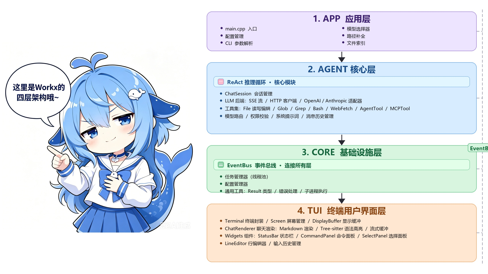

**分层与单向依赖**：`core ← agent ← tui ← app`，禁止反向依赖（由 `test_layer_boundary` 编译期校验）。其中 `workx_core` + `workx_agent` 可安装供外部消费（Agent Harness），`workx_tui` / `workx_app` 为内部宿主目标；公共 API 面由 `WORKX_PUBLIC_HEADERS` 白名单界定（`src/CMakeLists.txt`）。

### 核心工作流（鲸鱼娘图解）

| 📐 ReAct 推理循环 | 📡 EventBus 跨层中枢 |
|---|---|
| 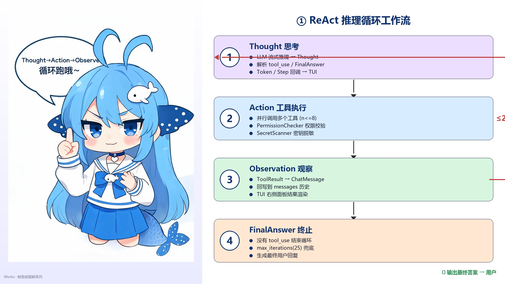 | 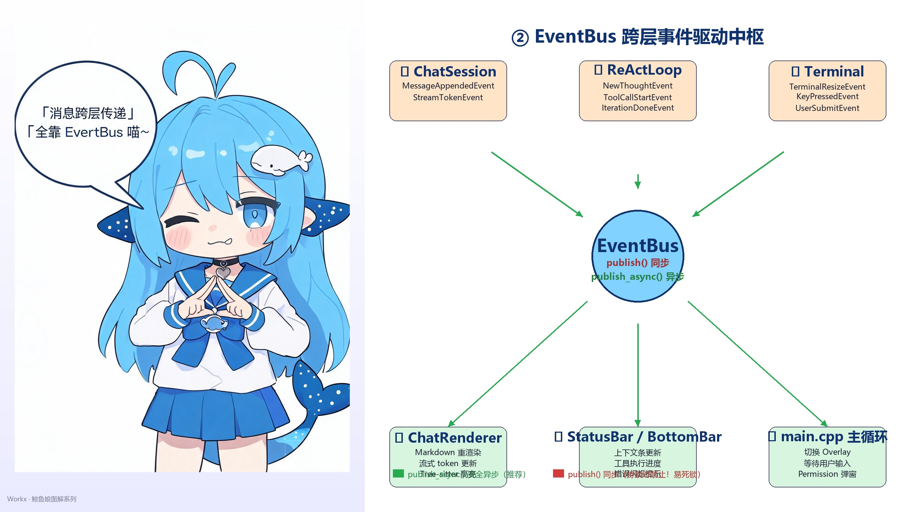 |
| Thought → Action → Observe 循环 ≤25 轮，无工具调用即输出 FinalAnswer | 发布-订阅解耦四层：TUI/Agent/Core 异步消息驱动，同步 publish 需防死锁 |

```
src/
├── agent/              # Agent 核心层
│   ├── api/            # LLM 后端接口（OpenAI/Anthropic 适配器、SSE 流、HTTP 客户端）
│   ├── command/        # 命令执行器与注册表
│   ├── compact/        # Token 压缩与上下文截断
│   ├── core/           # 会话管理、查询引擎、ReAct 推理循环
│   ├── input/          # 输入解析与处理
│   ├── message/        # 消息构建与历史管理
│   ├── model/          # 模型配置、提供商预设、模型路由
│   ├── permission/     # 权限校验、权限模式、规则定义
│   ├── prompt/         # 系统提示词与记忆管理
│   ├── tool/           # 工具集（Agent 自主调用的能力）
│   │   ├── AgentTool/      # 子 Agent 调度（任务分解与并行执行）
│   │   ├── BashTool/       # Shell 命令执行
│   │   ├── FileEditTool/   # 文件精确编辑
│   │   ├── FileReadTool/   # 文件读取
│   │   ├── FileWriteTool/  # 文件写入（含 Diff 生成）
│   │   ├── GlobTool/       # 文件名模式匹配
│   │   ├── GrepTool/       # 内容正则搜索
│   │   ├── MCPTool/        # Model Context Protocol 工具桥接
│   │   └── WebFetchTool/   # 网页内容抓取
│   └── util/           # 异步、JSON Schema、字符串工具
├── app/                # 应用层
│   ├── command/        # 内置系统命令
│   ├── config/         # 配置管理、CLI 参数解析
│   ├── ui/             # 模型选择器、路径补全、文件索引
│   └── main.cpp        # 程序入口
├── core/               # 核心基础设施
│   ├── config/         # 配置管理器
│   ├── events/         # 事件总线（驱动 Agent 与 UI 解耦）
│   ├── task/           # 任务管理器
│   └── utils/          # Result 类型等通用工具
└── tui/                # 终端用户界面
    ├── core/           # 终端封装、屏幕管理、显示缓冲（Win32/POSIX）
    ├── input/          # 行编辑器、输入历史
    ├── render/         # 聊天渲染、Markdown 渲染、Tree-sitter 语法高亮、流式缓冲
    ├── setup/          # 设置向导
    ├── utils/          # UTF-8 工具函数
    └── widgets/        # 状态栏、命令面板、文件搜索面板、底部栏
```

## 支持的 AI 提供商

仅内置中国顶级模型厂商预设，另支持自定义 OpenAI 兼容端点：

| 提供商 | 预设名称 | 默认模型 |
|--------|----------|----------|
| DeepSeek | `deepseek` | deepseek-v4-flash |
| 智谱 GLM | `glm` | glm-5.2 |
| Kimi (Moonshot) | `kimi` | kimi-k3 |
| 通义千问 (Qwen) | `qwen` | qwen-plus |
| MiniMax | `minimax` | MiniMax-M3 |
| Custom URL | `openai-compatible` | (自定义) |

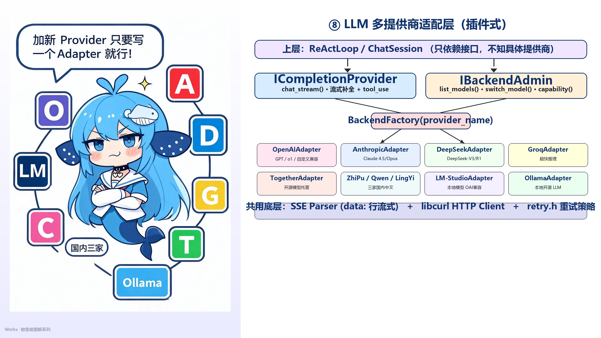

> 架构分层：上层 `ReActLoop/ChatSession` 只依赖 `ICompletionProvider + IBackendAdmin` 双接口，新增 Provider 只需实现一个 Adapter。

## Agent 工具能力

WorkX 的核心是 Agent 自主调用工具完成任务。内置工具集如下：

| 工具 | 说明 |
|------|------|
| `FileReadTool` | 读取文件内容，支持行范围与偏移 |
| `FileWriteTool` | 创建或覆盖文件，并生成 Diff |
| `FileEditTool` | 基于字符串替换的精确编辑 |
| `GlobTool` | 按文件名 glob 模式快速查找文件 |
| `GrepTool` | 基于 ripgrep 的内容正则搜索 |
| `BashTool` | 执行 Shell 命令（受权限系统管控） |
| `WebFetchTool` | 抓取并提取网页内容 |
| `AgentTool` | 启动子 Agent 处理子任务，支持并行调度 |
| `MCPTool` | 桥接 MCP 服务器，接入外部工具与数据源 |

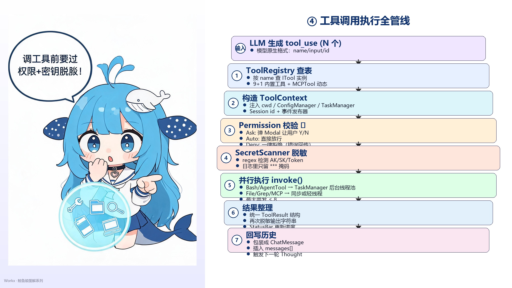

> 执行顺序：Registry 查表 → 构造 ToolContext → Permission 校验 Ask/Auto/Deny → SecretScanner 脱敏 → TaskManager 并行 invoke → 结果回写 messages。
>
> **MCP 桥接：** 通过 JSON-RPC 跨进程调用第三方 MCP Server，无需改 Workx 本体即可扩展外部工具。
>
> 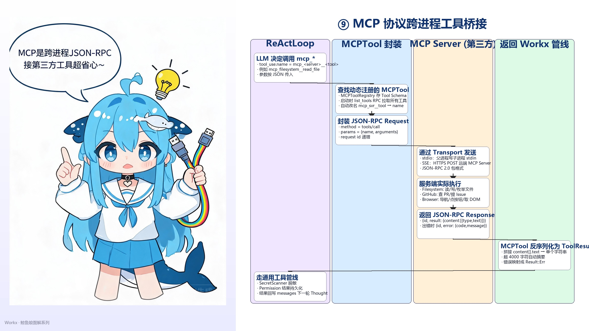

## 上下文管理 & Token 压缩

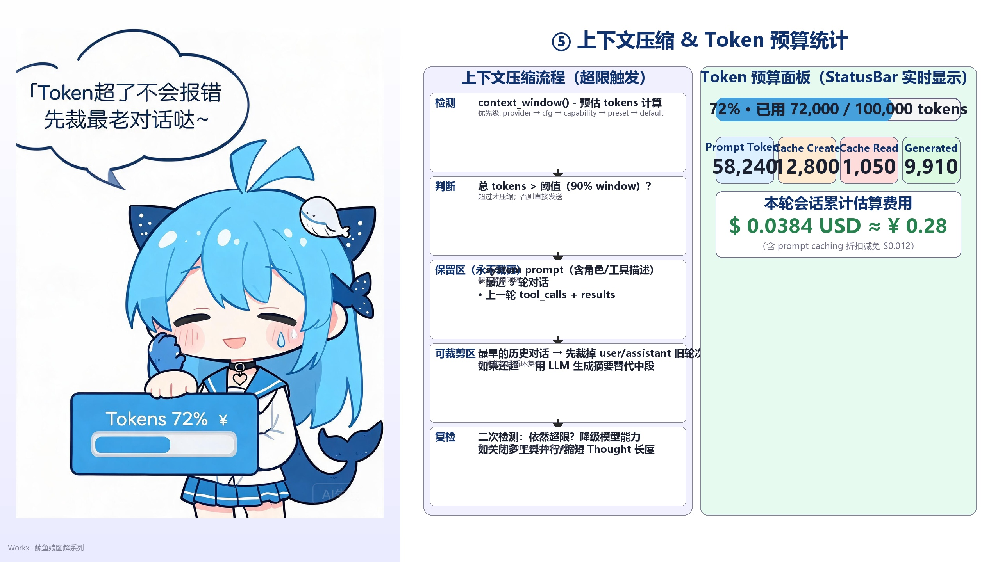

- **触发条件**：总 Token 用量超过上下文窗口 90%（优先级：provider → cfg → capability → preset → default）
- **永不裁剪区**：system prompt + 最近 5 轮对话 + 上一轮 tool_calls/results
- **兜底策略**：中段历史摘要压缩 → 依然超限降级多工具并行 → 最后抛 `ContextOverflowError`
- **实时面板**：StatusBar 显示 4 类计数（Prompt / Cache Create / Cache Read / Generated）+ 估算费用

## 前置条件

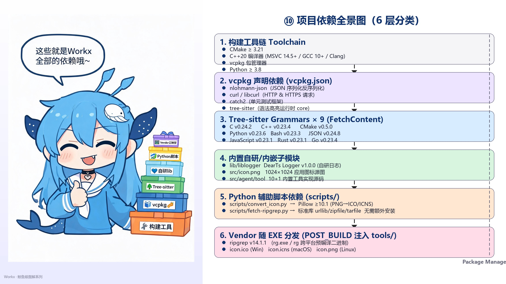

- **CMake**: 3.21 或更高版本
- **C++ 编译器**: 支持 C++20（MSVC 14.5+ 或 GCC 10+）
- **vcpkg**: 依赖包管理器

## 构建步骤

> **注意**: 当前版本仅支持 Windows 平台。

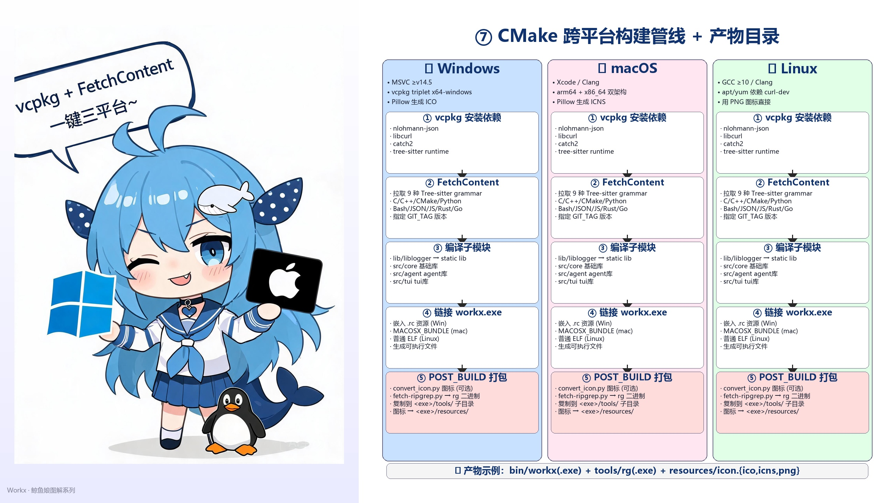

### Linux
```bash
cmake -B _build -DCMAKE_TOOLCHAIN_FILE=/home/young/WorkSpace/vcpkg/scripts/buildsystems/vcpkg.cmake
cd _build && make


```

### Windows (MSVC)

```bash
# 初始化 vcpkg（首次使用）
vcpkg install nlohmann-json catch2 curl

# 创建构建目录
mkdir build
cd build

# 配置 CMake（替换 [vcpkg_root] 为你的 vcpkg 安装路径）
cmake .. -DCMAKE_TOOLCHAIN_FILE=[vcpkg_root]/scripts/buildsystems/vcpkg.cmake

# 构建
cmake --build . --config Release
```

## 运行

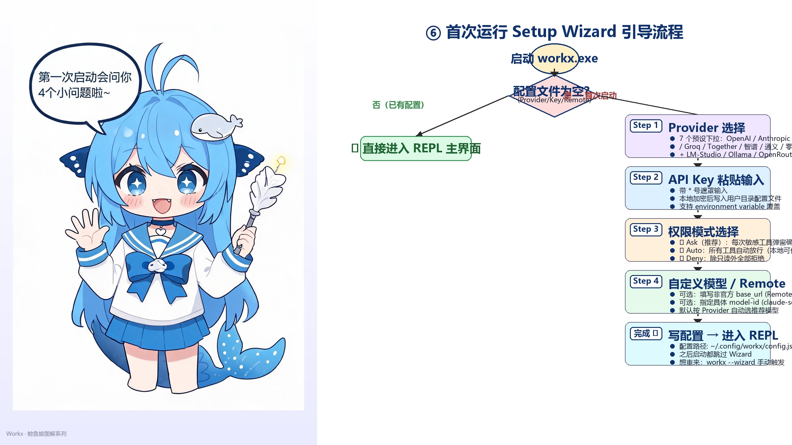

```bash
# Windows
build\bin\workx.exe

# Linux/macOS
./build/bin/workx
```

首次运行时会启动设置向导，引导您配置 API Key 和选择默认模型。

## 命令参考

| 命令 | 说明 |
|------|------|
| `/help` | 显示所有可用命令 |
| `/exit` / `/quit` | 退出程序 |
| `/clear` | 清空聊天历史 |
| `/regen` | 重新生成上一条回复 |
| `/model` | 切换当前使用的模型 |

## TUI 渲染注意事项（开发必读）

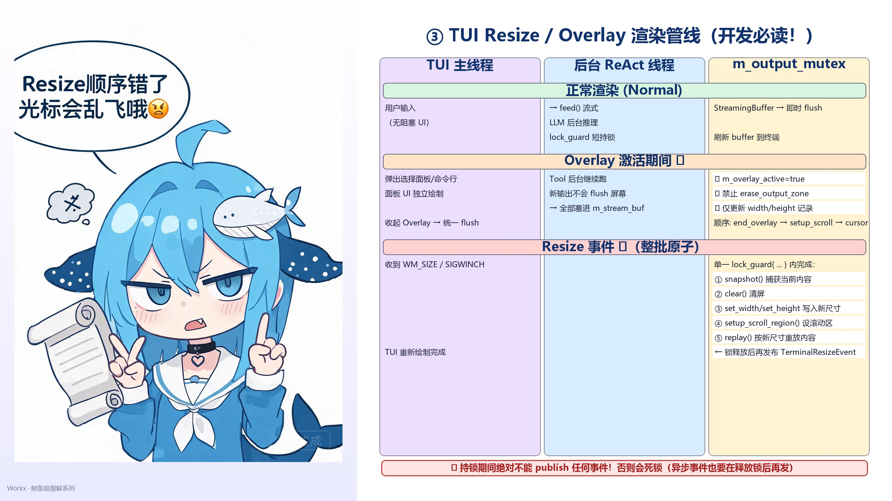

## 配置

配置文件位于用户目录下，包含 API Key、默认模型、超时设置等。设置向导会在首次运行时生成配置。

## 测试

```bash
# 运行单元测试 (默认构建)
build/bin/workx_unit_tests.exe

# 运行集成测试 (需启用 -DWORKX_BUILD_INTEGRATION_TESTS=ON, 且需 LM Studio)
build/bin/workx_integration_tests.exe
```

项目包含 100+ 个测试用例，覆盖核心功能模块。

## 许可证

MIT License
