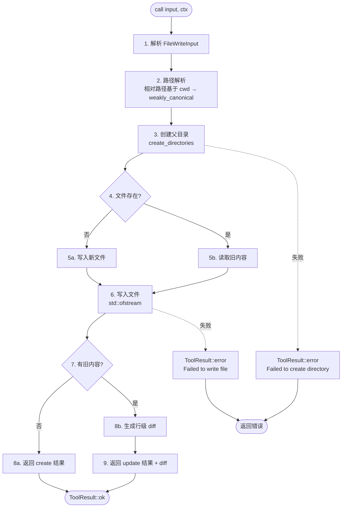

# FileWriteTool 实现计划

> 基于 Claude Code 源码分析 (`claude-code-src/src/tools/FileWriteTool/`) + mydev 编码规范
> 参照 FileReadTool v1.3.0 实现模式
> 日期：2026-07-15

---

## 一、现状分析

### 当前 C++ 实现（stub）

```
src/agent/tool/FileWriteTool/
├── file_write_tool.h      # 接口声明（v1.0.0，仅声明 4 个方法，无私有方法）
├── file_write_tool.cpp    # 实现（v1.0.0，call() 返回 "not implemented"）
└── README.md              # Claude Code 源码分析文档
```

**问题清单：**

| 问题 | 现状 | 目标 |
|------|------|------|
| `description()` 文案 | "Writes content to a file, creating or overwriting it." | "Write a file to the local filesystem."（对齐 CC） |
| `prompt()` 内容 | 3 行简述 | 完整 Usage 说明（对齐 CC `getWriteToolDescription()`） |
| `input_schema()` 缺少 `additionalProperties` | 无此字段 | `additionalProperties: false`（对齐 CC `z.strictObject`） |
| `validate_input()` | 未实现（基类默认通过） | 校验 file_path 非空 + content 类型 |
| `call()` | TODO stub | 完整写入管道 |
| 无 diff 生成 | — | 更新模式下生成行级 diff |
| 无目录创建 | — | 自动创建父目录（`mkdir -p` 语义） |

### Claude Code 源码关键逻辑

```
FileWriteTool.call() 管道：
1. expandPath(file_path)           → 路径展开（~ → home）
2. discoverSkillDirsForPaths()     → 技能目录发现（跳过，不适用）
3. diagnosticTracker.beforeFileEdited() → LSP 诊断（跳过）
4. fs.mkdir(dir)                   → 确保父目录存在
5. fileHistoryTrackEdit()          → 文件历史备份（跳过）
6. readFileSyncWithMetadata()      → 读取现有文件（判断 create/update）
7. staleness check                 → 对比 mtime vs readFileState（跳过，无 read tracking）
8. writeTextContent(path, content, enc, 'LF') → 写入文件（LF 行尾）
9. LSP didChange/didSave           → LSP 通知（跳过）
10. notifyVscodeFileUpdated()      → VSCode 通知（跳过）
11. readFileState.set()            → 更新读取状态（跳过）
12. getPatchForDisplay()           → 生成 diff（update 模式）
13. 返回 { type, filePath, content, structuredPatch, originalFile }
```

**CC 特性取舍：**

| CC 特性 | 是否实现 | 理由 |
|---------|---------|------|
| 路径展开（`expandPath`） | ✅ 用 `weakly_canonical` 替代 | C++ 有 `std::filesystem` |
| 父目录创建 | ✅ `create_directories` | 核心功能 |
| 文件存在性判断（create/update） | ✅ `fs::exists` | 核心功能 |
| Pre-read 检查 | ❌ Phase 2 | 需 FileReadStateTracker 基础设施 |
| 文件 staleness 检查 | ❌ Phase 2 | 依赖 pre-read tracking |
| Diff 生成 | ✅ 简化版行级 diff | 核心反馈 |
| LSP 集成 | ❌ 不适用 | TUI 项目无 LSP |
| VSCode 通知 | ❌ 不适用 | TUI 项目无 VSCode |
| 技能目录发现 | ❌ 不适用 | 无技能系统 |
| 文件历史备份 | ❌ Phase 3 | 需独立基础设施 |
| Git diff | ❌ Phase 3 | 需 git 集成 |
| Analytics 日志 | ❌ 不适用 | 无分析服务 |
| 行尾处理（强制 LF） | ✅ 直接写入 content | CC 也是直接写入，不重写行尾 |
| UNC 路径安全 | ❌ 暂不处理 | Windows 边缘场景，Phase 3 |

---

## 二、实现目标

### Phase 1（本次实现）— 核心写入管道

```
v1.0.0 (stub) → v2.0.0
```

**目标：** 完整的文件创建/覆盖写入管道，对齐 Claude Code prompt + schema，生成简化 diff。

**不做：** pre-read tracking、staleness 检查、LSP、文件历史、git diff。

### Phase 2（后续）— 安全性增强

- FileReadStateTracker 单例（记录已读文件 + mtime）
- Pre-read 强制检查（现有文件必须先 Read）
- Staleness 检查（文件被外部修改后拒绝写入）
- 文件备份（写入前保存 .bak）

### Phase 3（远期）— 高级特性

- Git diff 集成
- 文件历史追踪
- UNC 路径安全处理
- 配置化参数（最大写入大小限制）

---

## 三、文件清单

### 新建文件

| 文件 | 用途 |
|------|------|
| `src/agent/tool/FileWriteTool/diff.h` | 简化 diff 生成工具（行级对比） |
| `src/agent/tool/FileWriteTool/diff.cpp` | diff 实现 |

### 修改文件

| 文件 | 改动 |
|------|------|
| `src/agent/tool/FileWriteTool/file_write_tool.h` | v2.0.0：新增 `validate_input()`、私有辅助方法声明、Doxygen 注释 |
| `src/agent/tool/FileWriteTool/file_write_tool.cpp` | v2.0.0：完整实现 call() 管道、prompt/schema 对齐 |
| `src/agent/tool/FileWriteTool/README.md` | 重写为实现文档（保留 CC 分析为参考附录） |
| `CMakeLists.txt` | 添加 `diff.cpp` 到 WORKX_SOURCES |

### 不变文件

| 文件 | 理由 |
|------|------|
| `types.h` | `FileWriteInput`/`FileWriteOutput` 已定义，无需修改 |
| `itool.h` | 接口不变 |
| `result.h` | `ToolResult` 不变 |
| `context.h` | `ToolContext` 不变 |
| `constants.h` | Phase 1 无新常量 |

---

## 四、实现细节

### 4.1 Schema 对齐（file_write_tool.cpp）

#### `name()`
```cpp
const std::string& FileWriteTool::name() const {
    static const std::string n{"Write"};
    return n;
}
```
> 不变，已对齐 CC `FILE_WRITE_TOOL_NAME = 'Write'`

#### `description()`
```cpp
const std::string& FileWriteTool::description() const {
    static const std::string d{"Write a file to the local filesystem."};
    return d;
}
```
> 对齐 CC `DESCRIPTION`，当前文案需修改

#### `prompt()`
```cpp
const std::string& FileWriteTool::prompt() const {
    static const std::string p{
        "Writes a file to the local filesystem.\n"
        "\n"
        "Usage:\n"
        "- This tool will overwrite the existing file if there is one at the provided path.\n"
        "- If this is an existing file, you MUST use the Read tool first to read the file's contents. "
        "This tool will fail if you did not read the file first.\n"
        "- Prefer the Edit tool for modifying existing files — it only sends the diff. "
        "Only use this tool to create new files or for complete rewrites.\n"
        "- NEVER create documentation files (*.md) or README files unless explicitly requested by the User.\n"
        "- Only use emojis if the user explicitly requests it. Avoid writing emojis to files unless asked.\n"
        "- The file_path parameter must be an absolute path, not a relative path."
    };
    return p;
}
```
> 对齐 CC `getWriteToolDescription()` + `getPreReadInstruction()`
> 末尾补充绝对路径要求（与 FileReadTool 一致）
> 注：Phase 1 的 pre-read 检查未实现，但 prompt 先对齐（文档引导 LLM 行为）

#### `input_schema()`
```cpp
nlohmann::json FileWriteTool::input_schema() const {
    return {
        {"type", "object"},
        {"properties", {
            {"file_path", {
                {"type", "string"},
                {"description", "The absolute path to the file to write (must be absolute, not relative)"}
            }},
            {"content", {
                {"type", "string"},
                {"description", "The content to write to the file"}
            }}
        }},
        {"required", {"file_path", "content"}},
        {"additionalProperties", false}
    };
}
```
> 对齐 CC `z.strictObject` → `additionalProperties: false`
> description 对齐 CC 原文

#### `validate_input()`
```cpp
ValidationResult FileWriteTool::validate_input(
    const nlohmann::json& input,
    const ToolContext& /*ctx*/
) const {
    if (!input.contains("file_path") || !input["file_path"].is_string()) {
        return ValidationResult::err("Missing required field: file_path");
    }
    if (input["file_path"].get<std::string>().empty()) {
        return ValidationResult::err("file_path must not be empty");
    }
    if (!input.contains("content") || !input["content"].is_string()) {
        return ValidationResult::err("Missing required field: content");
    }
    return ValidationResult::ok();
}
```
> 校验 file_path 非空字符串 + content 为字符串（允许空内容，空文件合法）

### 4.2 call() 执行管道



#### 步骤详解

**Step 1 — 解析输入**
```cpp
FileWriteInput write_input = input.get<FileWriteInput>();
```

**Step 2 — 路径解析**（与 FileReadTool 一致）
```cpp
fs::path file_path(write_input.file_path);
if (file_path.is_relative()) {
    if (!ctx.cwd.empty()) {
        file_path = fs::path(ctx.cwd) / file_path;
    }
}
std::error_code ec;
file_path = fs::weakly_canonical(file_path, ec);
if (ec) ec.clear();
```

**Step 3 — 创建父目录**
```cpp
const fs::path parent_dir = file_path.parent_path();
if (!parent_dir.empty() && !fs::exists(parent_dir, ec)) {
    fs::create_directories(parent_dir, ec);
    if (ec) {
        return ToolResult::error("Failed to create directory: " + parent_dir.string());
    }
}
```
> 对齐 CC `fs.mkdir(dir)`；用 `create_directories` 实现 `mkdir -p` 语义

**Step 4 — 判断 create/update**
```cpp
const bool is_update = fs::exists(file_path, ec);
```

**Step 5b — 读取旧内容（update 模式）**
```cpp
std::string old_content;
if (is_update) {
    std::ifstream old_file(file_path);
    if (old_file.is_open()) {
        old_content = std::string(
            std::istreambuf_iterator<char>(old_file),
            std::istreambuf_iterator<char>()
        );
    }
    // 读取失败不中断，old_content 为空，diff 会显示全部新增
}
```

**Step 6 — 写入文件**
```cpp
std::ofstream out(file_path, std::ios::binary | std::ios::trunc);
if (!out.is_open()) {
    return ToolResult::error("Failed to open file for writing: " + write_input.file_path);
}
out << write_input.content;
out.close();
```
> `std::ios::binary` 避免平台自动转换行尾
> CC 也是直接写入 content，不重写行尾（`writeTextContent(path, content, enc, 'LF')`）

**Step 7-8b — 生成 diff（update 模式）**
```cpp
std::string result_text;
if (is_update) {
    auto diff_lines = generate_line_diff(old_content, write_input.content);
    result_text = format_diff_result(file_path.string(), diff_lines);
} else {
    result_text = "File created successfully at: " + file_path.string();
}
```

**Step 9 — 返回结果**
```cpp
return ToolResult::ok(std::move(result_text));
```

### 4.3 Diff 生成工具（diff.h / diff.cpp）

#### 设计

简化版行级 diff，基于 LCS（最长公共子序列）算法：

```cpp
// diff.h
namespace agent::tool {

/// @brief Diff 操作类型
enum class DiffOp {
    Equal,    ///< 未变更行
    Add,      ///< 新增行
    Remove,   ///< 删除行
};

/// @brief 单个 diff 行
struct DiffLine {
    DiffOp op;          ///< 操作类型
    int old_line_no;    ///< 旧文件行号（1-based，0 = 无）
    int new_line_no;    ///< 新文件行号（1-based，0 = 无）
    std::string text;   ///< 行内容
};

/// @brief 生成行级 diff
/// @param old_content 旧文件内容
/// @param new_content 新文件内容
/// @return diff 行列表
std::vector<DiffLine> generate_line_diff(
    const std::string& old_content,
    const std::string& new_content
);

/// @brief 格式化 diff 为可读文本
/// @param file_path 文件路径
/// @param diff_lines diff 行列表
/// @return 格式化后的 diff 文本
std::string format_diff(
    const std::string& file_path,
    const std::vector<DiffLine>& diff_lines
);

} // namespace agent::tool
```

#### LCS 算法

```
1. 将 old/new content 按行分割
2. 构建 LCS 矩阵（O(n*m) 时间和空间）
3. 回溯生成 diff 序列：
   - LCS 中的行 → Equal
   - old 有 new 无 → Remove
   - new 有 old 无 → Add
```

#### 输出格式

```
--- a/src/main.cpp
+++ b/src/main.cpp
@@ -10,3 +10,4 @@
 int main() {
-    return 0;
+    std::cout << "Hello";
+    return 0;
 }
```

> 简化版 unified diff 格式，便于 LLM 理解变更

### 4.4 头文件声明（file_write_tool.h）

```cpp
/**
 * @file file_write_tool.h
 * @brief FileWriteTool — 文件写入工具
 * @details 创建或覆盖文件内容，自动创建父目录，更新时生成行级 diff。
 *          路径解析基于 ToolContext::cwd，相对路径会被自动规范化为绝对路径。
 * @author workx
 * @version 2.0.0
 * @date 2026-07
 */

#pragma once

#include <string>
#include <filesystem>
#include "agent/tool/itool.h"
#include "agent/tool/types.h"

namespace agent::tool {

/// @brief FileWriteTool — 文件写入工具
///
/// 创建新文件或覆盖现有文件内容：
/// - 自动创建父目录（mkdir -p 语义）
/// - 更新时生成行级 diff（LCS 算法）
/// - 路径解析基于 ToolContext::cwd
///
/// @par 执行管道
/// 1. 解析输入 → 2. 路径解析 → 3. 创建父目录
/// → 4. 判断 create/update → 5. 读取旧内容（update）
/// → 6. 写入文件 → 7. 生成 diff（update） → 8. 返回结果
///
/// @par 错误处理
/// 所有错误通过 ToolResult::error() 返回，不抛异常。
class FileWriteTool : public ITool {
public:
    const std::string& name() const override;
    const std::string& description() const override;
    const std::string& prompt() const override;
    nlohmann::json input_schema() const override;

    ValidationResult validate_input(
        const nlohmann::json& input,
        const ToolContext& ctx
    ) const override;

    ToolResult call(
        const nlohmann::json& input,
        const ToolContext& ctx
    ) override;
};

} // namespace agent::tool
```

> 与 FileReadTool 风格一致：Doxygen 注释、执行管道说明、错误处理声明
> Phase 1 无私有辅助方法（diff 逻辑在 diff.h/diff.cpp 中）

### 4.5 CMakeLists.txt

在 `WORKX_SOURCES` 中 `file_write_tool.cpp` 后添加：

```cmake
src/agent/tool/FileWriteTool/diff.cpp
```

---

## 五、与 Claude Code 对标

### 特性对比表

| 特性 | Claude Code | 本工具 (v2.0.0) | 差异说明 |
|------|-------------|-----------------|----------|
| 文件创建 | ✅ | ✅ | 一致 |
| 文件覆盖 | ✅ | ✅ | 一致 |
| 绝对路径要求 | ✅ 必须绝对 | ✅ prompt 声明绝对，代码宽容相对 | 本工具更鲁棒 |
| `additionalProperties` | false | false | 一致 |
| 父目录自动创建 | ✅ `fs.mkdir` | ✅ `create_directories` | 一致 |
| Diff 生成 | ✅ `getPatchForDisplay` | ✅ LCS 行级 diff | 算法不同，均生成 unified diff |
| Pre-read 强制检查 | ✅ `readFileState` | ❌ Phase 2 | 需 FileReadStateTracker |
| Staleness 检查 | ✅ mtime 对比 | ❌ Phase 2 | 依赖 pre-read tracking |
| 行尾处理 | 直接写入 content | 直接写入 content | 一致 |
| LSP 集成 | ✅ didChange/didSave | ❌ | 不适用（TUI） |
| 文件历史备份 | ✅ `fileHistoryTrackEdit` | ❌ Phase 3 | 需独立基础设施 |
| Git diff | ✅ `fetchSingleFileGitDiff` | ❌ Phase 3 | 需 git 集成 |
| 返回结构 | `{ type, filePath, content, structuredPatch, originalFile }` | 文本结果 | 本工具返回文本（含 diff） |
| `description()` | "Write a file to the local filesystem." | ✅ 一致 | 对齐 |
| `prompt()` 完整 Usage | ✅ | ✅ | 对齐 |

### 设计差异分析

#### 1. 返回格式

- **CC**：返回结构化 JSON（`type`、`filePath`、`content`、`structuredPatch`、`originalFile`）
- **本工具**：返回文本（`"File created successfully at: ..."` 或 `"File updated. ..."` + diff 文本）
- **决策**：Phase 1 返回文本（与 FileReadTool 一致，ToolResult::ok(string)）；Phase 2 可扩展为结构化 JSON

#### 2. Pre-read 检查

- **CC**：强制要求现有文件必须先 Read，否则 `validateInput` 返回错误
- **本工具**：Phase 1 不检查（无 FileReadStateTracker 基础设施）
- **决策**：prompt 中已声明 "MUST use Read tool first"（引导 LLM 行为），但代码不强制。Phase 2 实现 `FileReadStateTracker` 后再加入强制检查

#### 3. Diff 算法

- **CC**：使用 `getPatchForDisplay`（基于 `diff` 库的 Myers diff）
- **本工具**：LCS 算法（O(n*m) 时间空间，实现简单）
- **决策**：Phase 1 用 LCS（够用）；Phase 3 可升级 Myers（O(ND) 更高效）

#### 4. 文件大小限制

- **CC**：无显式大小限制（靠 `maxResultSizeChars: 100_000` 限制返回）
- **本工具**：Phase 1 不限制写入大小；Phase 3 可添加配置化 `MAX_FILE_WRITE_BYTES`

---

## 六、设计决策汇总

| 决策 | 理由 |
|------|------|
| 同步返回 `ToolResult` | 遵循项目约定，与 FileReadTool 一致 |
| `std::filesystem::create_directories` 创建父目录 | `mkdir -p` 语义，幂等 |
| `std::ofstream` binary 模式写入 | 避免平台自动转换行尾 |
| LCS 算法生成 diff | 实现简单，O(n*m) 对中小文件足够 |
| Phase 1 不做 pre-read 检查 | 需 FileReadStateTracker 基础设施，Phase 2 实现 |
| prompt 先对齐 CC（含 pre-read 指引） | 文档引导 LLM 行为，代码 Phase 2 补齐强制检查 |
| diff 独立为 `diff.h/.cpp` | 便于 FileEditTool 复用 |
| `additionalProperties: false` | 对齐 CC `z.strictObject`，严格 schema |
| content 允许空字符串 | 空文件合法（与 FileReadTool 空文件处理呼应） |
| 路径解析与 FileReadTool 一复用 | `weakly_canonical` + `std::error_code` 无异常 |

---

## 七、验证计划

### 编译验证

```bash
cmake --build build --target libworkx
```

### 功能验证项

| 场景 | 输入 | 预期输出 |
|------|------|----------|
| 创建新文件 | `file_path` 不存在 | "File created successfully at: ..." |
| 覆盖现有文件 | `file_path` 已存在 | "File ... has been updated." + diff |
| 自动创建父目录 | `file_path` 的父目录不存在 | 自动创建，写入成功 |
| 空内容写入 | `content = ""` | 创建空文件，成功 |
| 路径不存在且无法创建 | 无权限的路径 | ToolResult::error |
| file_path 缺失 | 无 file_path | ValidationResult::err |
| content 缺失 | 无 content | ValidationResult::err |
| file_path 为空 | `file_path = ""` | ValidationResult::err |
| 相对路径解析 | `file_path = "src/main.cpp"` | 基于 ctx.cwd 解析 |

### Diff 验证

| 场景 | 旧内容 | 新内容 | 预期 diff |
|------|--------|--------|-----------|
| 纯新增 | "" | "line1\nline2" | 2 行 Add |
| 纯删除 | "line1\nline2" | "" | 2 行 Remove |
| 部分修改 | "a\nb\nc" | "a\nB\nc" | 1 Remove + 1 Add |
| 无变化 | "a\nb" | "a\nb" | 2 行 Equal（无 diff 输出） |
| 末尾追加 | "a\nb" | "a\nb\nc" | 2 Equal + 1 Add |

---

## 八、实施步骤

### Step 1: 创建 diff 模块

- [ ] 创建 `diff.h`（DiffOp 枚举、DiffLine 结构体、generate_line_diff/format_diff 声明）
- [ ] 创建 `diff.cpp`（LCS 算法实现、unified diff 格式化）
- [ ] 添加到 `CMakeLists.txt`
- [ ] 编译验证 diff 模块

### Step 2: 重写 file_write_tool.h

- [ ] 版本号 → v2.0.0
- [ ] 添加 `validate_input()` 声明
- [ ] 添加 Doxygen 注释（执行管道、错误处理）
- [ ] 添加 `#include <filesystem>`

### Step 3: 重写 file_write_tool.cpp

- [ ] 修改 `description()` 对齐 CC
- [ ] 重写 `prompt()` 对齐 CC 完整 Usage
- [ ] 修改 `input_schema()` 添加 `additionalProperties: false`
- [ ] 实现 `validate_input()`
- [ ] 实现 `call()` 完整管道（路径解析 → mkdir → 判断 create/update → 读旧内容 → 写入 → diff → 返回）

### Step 4: 编译验证

- [ ] `cmake --build build --target libworkx` 通过
- [ ] 无警告（/W4）

### Step 5: 重写 README.md

- [ ] 保留 CC 源码分析为附录
- [ ] 主体改为实现文档（参照 FileReadTool README 结构）
- [ ] 包含：schema、字段表、执行管道、关键特性、错误处理、使用示例、设计决策、CC 对比、路线图

---

## 九、后续路线图

### Phase 2 — 安全性增强

- [ ] `FileReadStateTracker` 单例（记录已读文件路径 + mtime）
- [ ] Pre-read 强制检查（现有文件必须先 Read）
- [ ] Staleness 检查（文件被外部修改后拒绝写入）
- [ ] 文件备份（写入前保存 `.bak`）

### Phase 3 — 高级特性

- [ ] Git diff 集成
- [ ] 文件历史追踪
- [ ] 配置化参数（`MAX_FILE_WRITE_BYTES`）
- [ ] Myers diff 算法（替代 LCS，O(ND) 更高效）
- [ ] UNC 路径安全处理
