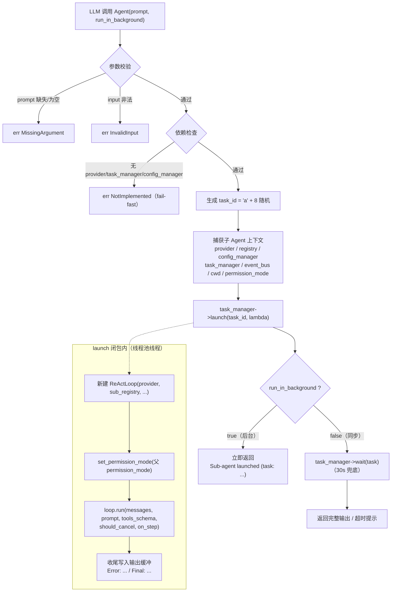
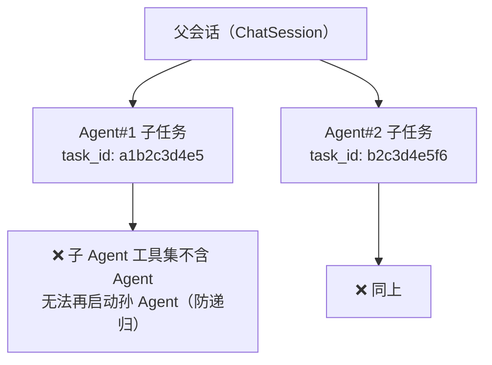
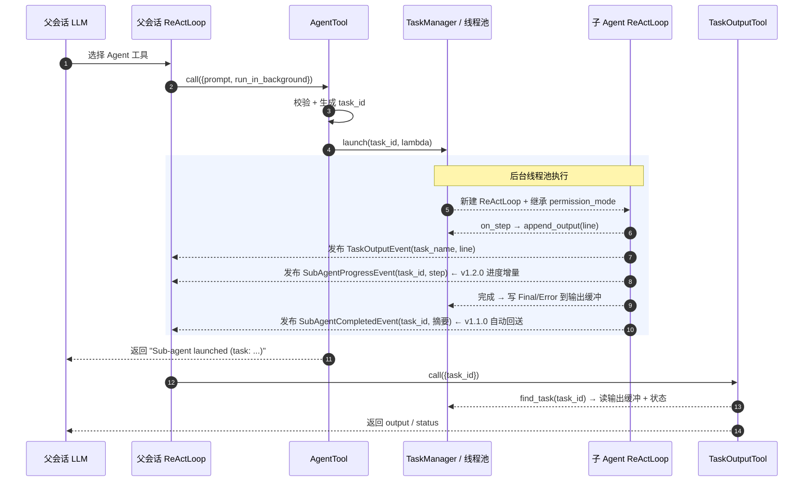

# AgentTool — 子 Agent 调度工具

> 启动子 Agent 处理独立子任务，支持后台/同步两种运行模式，通过进程级 `TaskManager` + 共享 `IEventBus` 与父会话异步通信。
>
> 对标 Claude Code CLI 的 `AgentTool`，在 WorkX 的 ReAct 架构下实现"任务分解 + 并行子 Agent"能力。
>
> 版本：v1.2.0

---

## 一、概述

`AgentTool` 是 Agent 工具集中负责"启动子 Agent"的工具，对应 LLM 工具名 `Agent`。支持：

- **后台运行（默认）**：`run_in_background=true` 时通过 `TaskManager::launch()` 投递到线程池，立即返回 `task_id`
- **并行批量调度**：`tasks` 数组一次启动多个子 Agent，各自独立 `task_id`，线程池并发执行（v1.2.0）
- **同步运行**：`run_in_background=false` 时阻塞等待子 Agent 完成，返回其完整输出
- **全新子会话**：子 Agent 使用全新消息历史，`system_prompt = prompt`
- **权限继承**：子 Agent 继承父会话 `permission_mode`，防止 Plan 只读边界被绕过
- **防递归**：子 Agent 工具集**强制排除 `Agent` 工具本身**（即使白名单显式包含 `Agent` 也会被忽略），杜绝子 Agent 再启动子 Agent 的无限嵌套/循环
- **工具集白名单**：`tools` 字段按名称过滤子 Agent 可用工具（空/缺失时使用全部已注册工具）
- **独立工具集**：子 Agent 使用独立 `ToolRegistry`，不共享父 registry 的暴露面；父处于 Plan（只读）时仅下发只读工具，双重防线防权限逃逸
- **后台结果自动回送**：子 Agent 完成后发布 `SubAgentCompletedEvent`（task_id + 结果摘要），订阅者无需轮询 TaskOutput 即可感知完成；仅作通知，不注入父 LLM 上下文
- **进度流式订阅**：子 Agent 每个 ReAct 步骤增量发布 `SubAgentProgressEvent`（task_id + 步骤类型 + 内容），订阅者可按 task_id 实时跟踪进度（v1.2.0）
- **协作取消/生命周期**：`TaskStopTool` 取消，`ChatSession` 析构时 `cancelAll + waitForAll` 防 use-after-free

### 文件清单

| 文件 | 用途 | 版本 |
|------|------|------|
| [agent_tool.h](agent_tool.h) | 工具接口声明 | v1.2.0 |
| [agent_tool.cpp](agent_tool.cpp) | 工具实现（task_id 生成 + 子 agent 启动 + 并行批量调度 + 同步/后台分发 + 独立工具集/白名单/只读过滤 + 后台结果自动回送 + 进度流式订阅） | v1.2.0 |
| [README.md](README.md) | 本文档 | v1.2.0 |

> 配套工具：`TaskOutputTool`（读子任务输出）、`TaskStopTool`（取消子任务），见 [tool/Task/](../Task/)。

### 依赖的内部模块

| 模块 | 用途 |
|------|------|
| [agent/core/react_loop.h](../../core/react_loop.h) | 子 Agent 的 `ReActLoop`（Reason→Act→Observe 循环） |
| [core/task/task_manager.h](../../../core/task/task_manager.h) | `ITaskManager::launch()` 后台任务 + `find_task()` |
| [core/task/thread_pool.h](../../../core/task/thread_pool.h) | 固定大小工作线程池（子 Agent 执行载体） |
| [agent/tool/context.h](../context.h) | `ToolContext`：provider / registry / config_manager / task_manager / event_bus / permission_mode |
| [agent/tool/registry.h](../registry.h) | `ToolRegistry`：子 Agent 工具集（`get_all_schemas`） |

---

## 二、工具元数据

| 字段 | 值 |
|------|-----|
| name | `Agent` |
| description | Launches a sub-agent to handle a complex task. |
| namespace | `agent::tool` |
| 基类 | `ITool` |
| 同步/异步 | 同步返回 `ResultV2<ToolResult>`（后台模式立即返回 task_id 文本） |

---

## 三、输入 Schema

```json
{
  "type": "object",
  "properties": {
    "prompt":            { "type": "string",  "description": "Single task prompt for the sub-agent (used when 'tasks' is omitted)" },
    "tasks":             { "type": "array",   "items": { "type": "object", "properties": {
                             "prompt": { "type": "string", "description": "Task prompt for one sub-agent" },
                             "tools":  { "type": "array", "items": { "type": "string" }, "description": "Allowed tools for this task (whitelist; empty uses all registered tools)" }
                           }, "required": ["prompt"], "additionalProperties": false },
                           "description": "Batch of sub-agent tasks to launch in parallel (each gets its own task_id)" },
    "tools":             { "type": "array",   "items": { "type": "string" }, "description": "Allowed tools for the sub-agent (whitelist; empty/omitted uses all registered tools)" },
    "run_in_background": { "type": "boolean", "description": "Run the sub-agent(s) in background (default true); false runs synchronously" }
  },
  "required": ["prompt"],
  "additionalProperties": false
}
```

### 字段说明

| 字段 | 类型 | 必填 | 默认值 | 说明 |
|------|------|------|--------|------|
| `prompt` | string | 是* | — | 子 Agent 的任务提示词，作为其 `system_prompt`（不允许空字符串）。提供 `tasks` 时忽略，否则必填 |
| `tasks` | object[] | 否 | — | 并行批量调度：一次启动多个子 Agent（v1.2.0）。每项含 `prompt`（必填）与可选 `tools`；提供时忽略顶级 `prompt`/`tools` |
| `tools` | string[] | 否 | — | 子 Agent 允许的工具集白名单（按名称过滤；空/缺失时使用全部已注册工具，未注册名称忽略） |
| `run_in_background` | bool | 否 | `true` | `true` 后台异步执行立即返回 task_id；`false` 同步阻塞等待完成 |

> `additionalProperties: false` 对齐其他工具 schema 严格策略，禁止额外字段。

---

## 四、输出格式

### 后台运行（默认）

立即返回任务信息文本，不阻塞：

```
Sub-agent launched (task: a1b2c3d4e5). Use TaskOutput to read its progress.
```

批量调度（`tasks` 数组）返回全部 `task_id`：

```
Sub-agents launched (2 tasks): a1b2c3d4e5, f6g7h8j9k1. Use TaskOutput to read their progress.
```

后续通过 `TaskOutputTool`（按 `task_id`）读取输出与状态，或 `TaskStopTool` 取消。

### 同步运行

阻塞等待子 Agent 完成（`TaskManager::wait` 内部带 30s 兜底超时），单个任务返回：

```
Sub-agents completed (1 tasks).
--- a1b2c3d4e5 ---
[1] Thought: ...
[2] Tool: FileReadTool
[3] Observation: ...
[4] Final: <final answer>
```

批量调度按 `task_id` 分段返回每个子 Agent 的输出；超时仍在运行的任务返回提示文本（可用 `TaskStop` 取消），不无限阻塞工具调用线程。

---

## 五、执行管道

### 5.0 整体流程图



### 5.1 call() 入口分发

```
call(input, ctx)
    │
    ▼
1. 参数解析与校验
   ├─ input 非对象            → err(InvalidInput)
   ├─ prompt 缺失/为空        → err(MissingArgument)
   └─ run_in_background 默认 true
    │
    ▼
2. 依赖检查（缺一即报错，fail-fast）
   ├─ ctx.provider_ptr 为空       → err(NotImplemented, "no LLM provider available")
   ├─ ctx.task_manager_ptr 为空   → err(NotImplemented, "no task manager available")
   └─ ctx.config_manager_ptr 为空 → err(NotImplemented, "no config manager available")
    │
    ▼
3. 生成 task_id = 'a' + 8 位随机小写字母数字
    │
    ▼
4. 捕获子 Agent 上下文到闭包
   ├─ provider / registry / config_manager / task_manager / event_bus / cwd
   └─ permission_mode（继承父会话权限模式，评审 #1）
    │
    ▼
5. task_manager->launch(task_id, lambda)     # 投递到进程级线程池
    │
    ▼
6. 分发
   ├─ run_in_background=false → task_manager->wait(task) + 组装完成/超时文本
   └─ 否则                    → 立即返回 "Sub-agent launched (task: ...)"
```

### 5.2 子 Agent 执行（launch 闭包内）

```
launch(task_id, ...)
    │
    ▼
1. 新建 ReActLoop(provider, sub_registry, config_manager, task_manager, cwd, event_bus)
    │
    ▼
2. loop.set_permission_mode(父 permission_mode)   # 继承权限，防 Plan 只读被绕过
    │
    ▼
3. 构建空消息历史 + tools_schema = sub_registry->get_all_schemas()
    │
    ▼
4. loop.run(messages, prompt, tools_schema, should_cancel, on_step)
   ├─ on_step 回调：每个 ReActStep → format_step_line → task->append_output(line)
   └─ should_cancel：绑定到 Task 的取消标志（协作取消）
    │
    ▼
5. 收尾写入输出缓冲
   ├─ result.was_error → append_output("Error: <error_message>")
   └─ final_answer      → append_output("Final: <final_answer>")
```

---

## 六、关键特性

### 6.1 run_in_background 模式

| 模式 | 行为 | 返回 |
|------|------|------|
| 后台（默认，`true`） | `TaskManager::launch()` 立即投递，主线程不阻塞 | `Sub-agent launched (task: ...)` |
| 同步（`false`） | `task_manager->wait(task)` 阻塞直到完成（30s 兜底） | 完整输出 / 超时提示 |

### 6.2 权限继承（评审 #1）

子 Agent 构造后 `loop.set_permission_mode(ctx.permission_mode)` 继承父会话权限模式：

- 父会话处于 **Plan（只读）** 时，子 Agent 同样只读，写/执行被 `check_permissions` 拒绝
- 防止父只读边界被子 Agent 以 Default 全权绕过（权限逃逸修复）

### 6.3 独立工具集（v1.1.0）

子 Agent 不再共享父 `ToolRegistry`，而是在 launch 闭包内构建**独立 `ToolRegistry`**：

- **白名单**：`tools` 非空则仅注册白名单内工具（未注册名忽略）；为空则注册全部已注册工具
- **Plan 只读**：父处于 Plan（只读）时，仅注册 `is_read_only() == true` 的工具（Read/Glob/Grep/WebFetch/TaskOutput/Skill），写/执行类工具从暴露面层剔除
- **双重防线**：与 6.2 的 `check_permissions` 运行时拒绝形成纵深防御——Plan 子 Agent 根本拿不到写/执行工具
- **防递归**：无论白名单如何，**强制排除 `Agent` 工具本身**，子 Agent 无法再启动子 Agent，杜绝无限嵌套/循环

> 工具实例本身仍由父/子共享（`call()` 标注 `const`、无实例可变状态，见 [itool.h](../itool.h) 线程安全保证），线程安全由该契约保障；独立的是 registry 暴露面与过滤逻辑。

### 6.4 防递归

子 Agent 构建工具集时**强制剔除 `Agent` 工具**（即使 `tools` 白名单显式包含 `Agent` 也会被忽略），因此子 Agent 内部无法再调用 `Agent` 启动孙子 Agent，杜绝无限递归/循环嵌套。



### 6.5 取消与生命周期（评审 #2）

- **取消**：`TaskStopTool` 调 `task_manager->cancel(task)` 置位 `Task::m_should_cancel`，子 `loop.run` 协作式取消
- **生命周期保护**：父 `ChatSession::~ChatSession()` 在成员销毁前 `cancelAll() + waitForAll()`，join 所有子 Agent 任务，防止后台线程访问已释放的 provider 等指针（use-after-free 修复）

### 6.6 通信机制

父子 Agent **不直接互相调用**，通过两层共享基础设施异步通信：

| 通道 | 说明 |
|------|------|
| 共享单例 | `TaskManager` 单例 + `IEventBus` + `ICompletionProvider` + `ToolRegistry` |
| 子 → 父（结果） | 子 Agent 写 `Task` 输出缓冲，并异步发布 `TaskOutputEvent`（仅含 `task_name + line`） |
| 子 → 父（进度） | 子 Agent 每个 ReAct 步骤发布 `SubAgentProgressEvent`（task_id + 步骤类型 + 内容，v1.2.0） |
| 子 → 父（回送） | 子 Agent 完成时发布 `SubAgentCompletedEvent`（task_id + 结果摘要，v1.1.0） |
| 父 → 子（读取） | `TaskOutputTool` 按 `task_id` 读输出缓冲 + 状态 |
| 父 → 子（控制） | `TaskStopTool` 取消任务 |



> 父 → 子控制（`TaskStopTool`）时序与 `TaskOutputTool` 对称：`cancel(task)` 置位 `m_should_cancel`，子 `loop.run` 协作式退出。

---

## 七、错误处理

所有错误通过 `ResultV2<ToolResult>::err()` 返回，不抛异常。

| 错误场景 | 错误码 | 错误信息 |
|---------|--------|---------|
| `input` 非对象 | `InvalidInput` | `Agent: input must be an object` |
| `prompt` 缺失/为空 | `MissingArgument` | `Agent: 'prompt' is required` |
| 无 LLM provider | `NotImplemented` | `Agent: no LLM provider available` |
| 无 task manager | `NotImplemented` | `Agent: no task manager available` |
| 无 config manager | `NotImplemented` | `Agent: no config manager available` |

---

## 八、使用示例

### 8.1 后台启动子 Agent

```cpp
#include "agent/tool/AgentTool/agent_tool.h"
#include "agent/tool/context.h"

using namespace agent::tool;

AgentTool tool;
ToolContext ctx;
ctx.cwd = "/home/user/project";
// ctx.provider_ptr / config_manager_ptr / task_manager_ptr / event_bus_ptr 由 ReActLoop 注入

nlohmann::json input = {
    {"prompt", "Analyze the codebase and summarize the architecture."},
    {"run_in_background", true}   // 默认即 true
};

auto r = tool.call(input, ctx);
// 立即返回，r.value().text 含 "Sub-agent launched (task: ...)"
```

### 8.2 同步等待结果

```cpp
nlohmann::json input = {
    {"prompt", "Refactor src/x.cpp to remove dead code."},
    {"run_in_background", false}
};

auto r = tool.call(input, ctx);
// 阻塞直到完成（30s 兜底），r.value().text 含子 Agent 各步骤与最终输出
```

### 8.3 配套：读取 / 取消子任务

```cpp
// TaskOutputTool：按 task_id 读输出
auto out = TaskOutputTool{}.call({{"task_id", "a1b2c3d4e5"}}, ctx);

// TaskStopTool：取消运行中的子任务
auto stop = TaskStopTool{}.call({{"task_id", "a1b2c3d4e5"}}, ctx);
```

---

## 九、与 Claude Code 对比

| 特性 | Claude Code | 本工具 (v1.1.0) | 差异说明 |
|------|-------------|-----------------|----------|
| 工具名 | `Agent` | `Agent` | 一致 |
| 后台运行 | ✅ | ✅ `run_in_background` | 一致 |
| 同步运行 | ✅ | ✅ `run_in_background=false` | 一致 |
| 子任务 ID | ✅ | ✅ `task_id`（`a`+8 随机） | 一致 |
| 子 Agent 独立会话 | ✅ | ✅ 全新消息历史 | 一致 |
| 权限继承 | ✅ | ✅ 继承父 `permission_mode` | 本工具显式 `set_permission_mode` |
| 子任务输出查询 | ✅ | ✅ `TaskOutputTool` | 一致 |
| 子任务取消 | ✅ | ✅ `TaskStopTool` | 一致 |
| 工具集过滤 | ✅ | ✅ `tools` 白名单生效 | 空/缺失时使用全部已注册工具 |
| 独立/只读工具集 | ✅ | ✅ 独立 registry + Plan 只读过滤 | 暴露面层隔离，双重防线 |
| 结果回传 LLM（后台） | ✅ | ✅ 发布 `SubAgentCompletedEvent`（通知，不注入上下文） | 一致（通知式） |
| 进度流式订阅 | ✅ | ✅ 发布 `SubAgentProgressEvent`（task_id + 步骤，增量） | 一致（通知式） |

### 设计差异分析

1. **权限继承**：子 Agent 显式继承父会话权限模式，保证 Plan 只读边界在并发子任务场景下不被绕过。
2. **生命周期**：父会话析构时统一 `cancelAll + waitForAll`，确保子任务线程不在 provider 销毁后存活。
3. **工具集过滤**：`tools` 字段按名称白名单过滤子 Agent 可用工具，未注册名称自动忽略；空/缺失时回退到全部已注册工具，兼顾安全与易用。
4. **独立/只读工具集**：子 Agent 使用独立 `ToolRegistry`，不共享父暴露面；父处于 Plan 时仅下发 `is_read_only()` 工具，与 `check_permissions` 形成纵深双重防线。
5. **后台结果回送**：后台子 Agent 完成后发布 `SubAgentCompletedEvent`（仅携带 task_id + 结果摘要），供订阅者无需轮询 TaskOutput 即可感知完成；**不注入父 LLM 上下文**，完整输出仍通过 `TaskOutputTool` 按需读取，避免长输出刷屏父会话。
6. **进度流式订阅**：子 Agent 每个 ReAct 步骤增量发布 `SubAgentProgressEvent`（task_id + step_type + 内容），订阅者可按 task_id 实时跟踪子任务进度；同样仅作增量通知，不注入父 LLM 上下文。

---

## 十、测试策略

单元测试见 [tests/unit/agent/tool/test_task_tools.cpp](../../../../tests/unit/agent/tool/test_task_tools.cpp)，覆盖：

| 类别 | 用例 | 期望结果 |
|------|------|---------|
| **参数校验** | 缺失/空 `prompt` | err(MissingArgument) |
| **依赖检查** | 无 provider | err(NotImplemented) |
| **后台运行** | 启动子 Agent 并写输出 | ok，含 `Sub-agent launched`，task_id 长 9 |
| **同步运行** | `run_in_background=false` | ok，含 `Sub-agent completed` 与子 Agent 输出 |
| **权限继承** | 父 Plan 模式启动子 Agent | ok（子 Agent 继承 Plan 只读） |
| **独立/只读工具集** | 父 Plan + 含只读/可写工具的 registry | 子 Agent schema 仅含只读工具 |
| **工具集过滤** | `tools` 白名单 + `get_schemas_by_names` | 仅保留匹配名称，未注册名忽略 |
| **防递归** | 父 registry 含 `Agent` 工具 + 白名单含 `Agent` | 子 Agent schema 不含 `Agent` |
| **后台结果自动回送** | 后台子 Agent 完成 | 发布 `SubAgentCompletedEvent`（task_id + 结果摘要） |
| **进度流式订阅** | 后台子 Agent 运行 | 增量发布 `SubAgentProgressEvent`（task_id 对齐，含 thought/final 类型） |
| **并行批量调度** | `tasks` 数组 | 一次启动多个子 Agent，各自独立 task_id |
| **TaskOutput** | 读已完成/运行中/超时任务 | ok，含 status/output |
| **TaskStop** | 停止运行中任务 | ok，任务进入 Cancelled |

> 配套 `TaskOutputTool` / `TaskStopTool` 的测试见同文件 `[task_output]` / `[task_stop]` 标签用例。

---

## 十一、设计决策

| 决策 | 理由 |
|------|------|
| 后台任务通过 `TaskManager::launch()` | 复用进程级线程池与事件总线，父子通过共享基础设施异步通信 |
| 子 Agent 用全新 `ReActLoop` + 空消息历史 | 任务粒度隔离，`system_prompt=prompt` 聚焦单一子任务 |
| 继承父 `permission_mode` | 安全优先，防止 Plan 只读边界被并发子任务绕过（评审 #1） |
| `tools` 白名单过滤（`get_schemas_by_names`） | 按名称裁剪子 Agent 工具集，未注册名忽略，空列表回退全部工具 |
| 独立 `ToolRegistry` + Plan 只读过滤 | 不共享父暴露面；Plan 下仅下发 `is_read_only()` 工具，与 `check_permissions` 双重防线 |
| 强制排除 `Agent` 工具本身 | 防递归：子 Agent 无法再启动子 Agent，杜绝无限嵌套/循环（即使白名单显式含 `Agent`） |
| `is_read_only()` 标记（IToolMetadata 默认 false） | 只读工具（Read/Glob/Grep/WebFetch/TaskOutput/Skill）覆盖为 true，供只读工具集过滤 |
| 析构 `cancelAll + waitForAll` | 绑定子任务生命周期到父会话，防 use-after-free（评审 #2） |
| 后台完成发布 `SubAgentCompletedEvent` | 通知式回送：订阅者免轮询感知完成；仅携带摘要，不注入父 LLM 上下文，避免刷屏 |
| `tasks` 数组并行批量调度 | 一次启动多个子 Agent，各自独立 `task_id`，线程池并发执行，提升任务吞吐 |
| 每步发布 `SubAgentProgressEvent` | 进度流式订阅：订阅者按 task_id 实时跟踪子任务进度，无需轮询 TaskOutput |
| `task_id = 'a' + 8 随机` | 对齐 TS generateTaskId，短且可读，前缀 `a` 区分任务 |
| `additionalProperties: false` | 严格 schema 校验，对齐其他工具 |
| 同步 wait 带 30s 兜底 | 防止 LLM 死循环/无响应时无限阻塞工具调用线程（评审 #3） |

---

## 十二、路线图

### v1.0.0（已完成 ✅）

- [x] 后台 + 同步双模式运行
- [x] 子 Agent 独立会话（`system_prompt = prompt`）
- [x] 权限继承（评审 #1）
- [x] 生命周期 join（评审 #2）
- [x] 同步 wait 30s 兜底（评审 #3）
- [x] 单元测试

### v1.1.0（已完成 ✅）

- [x] `tools` 字段生效：按白名单过滤子 Agent 工具集（`get_schemas_by_names`）
- [x] 子 Agent 独立/只读工具集（独立 `ToolRegistry` + `is_read_only()` + 并发线程安全审计）
- [x] 后台任务结果自动回送策略（`SubAgentCompletedEvent` 通知式回送，不注入父 LLM 上下文）
- [x] 防递归：子 Agent 工具集强制排除 `Agent` 工具本身

### v1.2.0（已完成 ✅）

- [x] 子 Agent 并行批量调度（`tasks` 数组一次启动多个子 Agent，各自独立 `task_id`）
- [x] 子任务进度流式订阅（`SubAgentProgressEvent` 事件总线增量推送，按 task_id 实时跟踪）