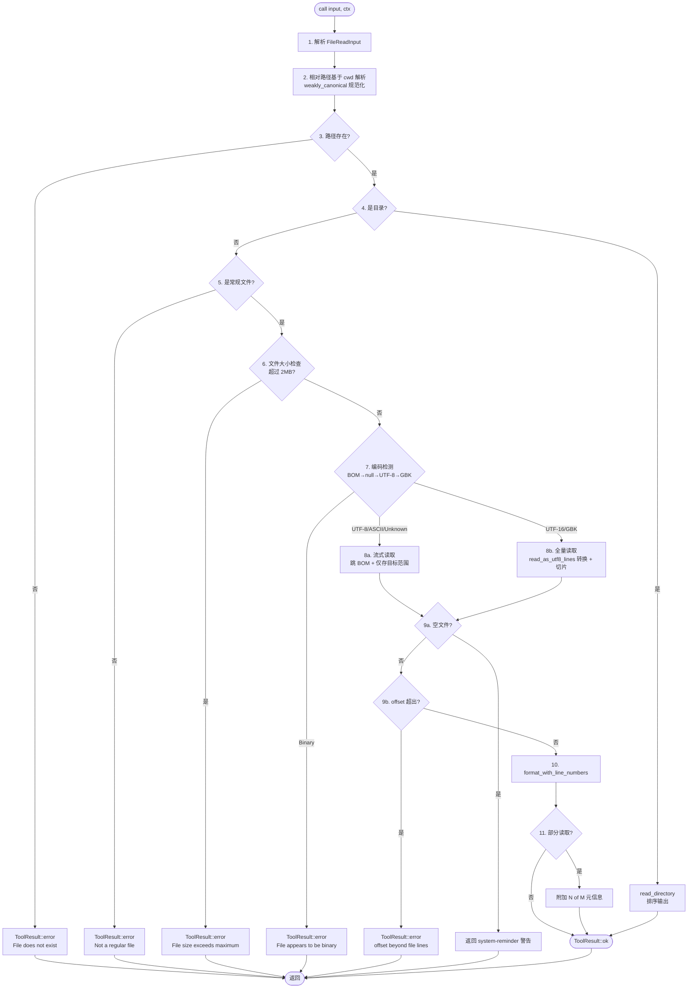

# FileReadTool — 文件读取工具

读取本地文件系统中的文本文件，支持行号显示、分段读取、编码自动检测（UTF-8/UTF-16/GBK）、二进制拒绝与目录列举。

## 目录结构

```
src/agent/tool/
├── encoding.h                # 编码检测与转换接口（v1.0.0，共享模块）
├── encoding.cpp              # 编码检测与转换实现
└── FileReadTool/
    ├── file_read_tool.h      # 接口声明（v1.3.0）
    ├── file_read_tool.cpp    # 实现（v1.3.0）
    └── README.md             # 本文档
```

## 工具元数据

| 字段 | 值 |
|------|-----|
| name | `Read` |
| description | Reads a file from the local filesystem. |
| namespace | `agent::tool` |
| 基类 | `ITool` |
| 同步/异步 | 同步（返回 `ToolResult`） |

## 输入 Schema

```json
{
  "type": "object",
  "properties": {
    "file_path": { "type": "string",  "description": "The absolute path to the file to read" },
    "offset":    { "type": "integer", "minimum": 1, "description": "The line number to start reading from. Only provide if the file is too large to read at once" },
    "limit":     { "type": "integer", "minimum": 1, "description": "The number of lines to read. Only provide if the file is too large to read at once." },
    "pages":     { "type": "string",  "description": "Page range for PDF files (e.g., \"1-5\", \"3\", \"10-20\"). Only applicable to PDF files. Maximum 20 pages per request." }
  },
  "required": ["file_path"],
  "additionalProperties": false
}
```

### 字段说明

| 字段 | 类型 | 必填 | 默认值 | 说明 |
|------|------|------|--------|------|
| `file_path` | string | 是 | — | 文件路径，支持相对路径（基于 `ctx.cwd` 解析） |
| `offset` | int | 否 | `1` | 起始行号（1-based） |
| `limit` | int | 否 | `2000`（`MAX_LINES_TO_READ`） | 最多读取的行数 |
| `pages` | string | 否 | — | PDF 页码范围（如 `"1-5"`、`"3"`、`"10-20"`，预留，当前版本未实现） |

## 输出格式

### 文本文件

每行格式：`右对齐行号→内容`，行号与内容之间使用 Unicode 箭头 `→` (U+2192)。

```
1→first line
2→second line
3→third line
```

部分读取时，末尾附加元信息：

```
 5→...
10→...

(6 of 100 lines shown)
```

### 目录

路径指向目录时，列出其内容（排序后），目录名后追加 `/`：

```
src/
README.md
CMakeLists.txt
```

空目录返回：`(empty directory)`

## 执行管道



## 关键特性

### 1. 编码自动检测与转换

读取前 8KB 探测文件编码，按优先级判定：

1. **BOM 检测**：UTF-8 (`EF BB BF`)、UTF-16LE (`FF FE`)、UTF-16BE (`FE FF`)
2. **null 字节**：判定为 `Binary`，拒绝读取（UTF-16 已由 BOM 排除，不会误判）
3. **UTF-8 验证**：逐字节校验多字节序列（`0xxxxxxx` / `110xxxxx 10xxxxxx` / …），纯 7-bit 返回 `Ascii`
4. **GBK 启发式**：双字节首字节 `0x81-0xFE`，次字节 `0x40-0xFE`（不含 `0x7F`）

| 编码 | 来源 | 读取策略 |
|------|------|----------|
| UTF-8 / ASCII / Unknown | 直接或验证通过 | 流式读取（`std::getline`），自动跳过 BOM |
| UTF-16LE / UTF-16BE | BOM | 全量读取 → 手动转 UTF-8（含代理对处理） |
| GBK | 启发式 | 全量读取 → 平台 API 转换（Windows: `MultiByteToWideChar` CP_936；Linux: `iconv`） |
| Binary | null 字节 | 拒绝读取，返回错误 |

```cpp
// encoding.h
Encoding detect_encoding(const std::filesystem::path& path);
std::vector<std::string> read_as_utf8_lines(const std::filesystem::path& path, Encoding encoding);
const char* encoding_name(Encoding encoding);
```

**为什么替换原 `is_binary_file`？** 旧实现仅查 null 字节，会把 UTF-16 文件（每字节交替为 0）误判为二进制。新方案先用 BOM 识别 UTF-16，再做 null 检测，避免误判；同时支持 GBK/UTF-16 自动转 UTF-8，对 Windows 中文环境更友好。

### 2. 行号格式化

- 行号右对齐，宽度按最大行号自动计算
- 行号与内容之间使用 `→` (U+2192, UTF-8: `\xe2\x86\x92`)
- 末尾换行符会被移除，避免多余空行

### 3. 路径解析

- 相对路径基于 `ToolContext::cwd` 解析
- 使用 `std::filesystem::weakly_canonical` 规范化路径（即使部分路径不存在也能规范化）
- 使用 `std::error_code` 重载，避免异常抛出

### 4. 目录列举

- 使用 `directory_iterator` 配合 `skip_permission_denied` 选项
- 遍历中遇到错误时跳过当前项（`ec.clear()`），不中断整体列举
- 结果按字典序排序，目录名追加 `/` 后缀以便区分

### 5. 分段读取

- `offset` 为 1-based 行号，默认 `1`（从第一行开始）
- `offset` 超出文件总行数时返回错误
- `limit` 默认 `2000`（`MAX_LINES_TO_READ`），未指定时最多读取 2000 行
- 部分读取时附加元信息：
  - 正常：`(N of M lines shown)`
  - 提前退出（文件更大）：`(N lines shown, more available)`

### 6. 流式读取（内存优化）

避免一次性加载全部行到内存。**仅 UTF-8/ASCII/Unknown 编码走流式路径**；UTF-16/GBK 因需全量转换，仍走 `read_as_utf8_lines()` 全量读取 + 切片。

- **单次遍历**：逐行扫描文件，计数所有行，仅存储 `[offset, offset+limit)` 范围内的行
- **内存占用 O(limit)**：仅保留目标行，非目标行读取后即丢弃
- **提前退出**：收集到足够行数后，检查是否还有剩余行，有则设置 `has_more` 标志并退出
- **元信息区分**：提前退出时显示 `more available`，完整读取时显示精确 `N of M`

```
文件 10000 行，offset=1, limit=2000：
  旧方案：加载 10000 行到内存 → 切片 2000 行 → 内存 O(10000)
  新方案：扫描 10000 行 → 仅存储 2000 行 → 提前退出 → 内存 O(2000)

非 UTF-8 路径（UTF-16/GBK）：
  全量读取 + 编码转换 → 切片 [offset, offset+limit) → 内存 O(N)
  （转换本身需要完整字节流，无法流式）
```

### 7. 文件大小限制

- 超过 2MB（`MAX_FILE_SIZE_BYTES = 2 * 1024 * 1024`）的文件拒绝读取
- 引导 LLM 对大文件使用 `offset` / `limit` 分段读取
- 避免一次性将大文件加载到内存导致性能问题

## 错误处理

所有错误通过 `ToolResult::error()` 返回，不抛异常。

| 错误场景 | 错误信息 |
|---------|---------|
| 路径不存在 | `File does not exist: <path>` |
| 非常规文件（如设备文件） | `Path is not a regular file: <path>` |
| 文件过大（>2MB） | `File size <N> bytes exceeds maximum 2097152 bytes; use offset and limit for larger files` |
| 二进制文件（编码检测判定） | `File appears to be binary, cannot display: <path>` |
| 文件打开失败 | `Failed to open file: <path>` |
| offset 超出范围 | `offset <N> is beyond the file's <M> lines` |

## 输入验证

`validate_input()` 在 `call()` 之前由 `ToolExecutor` 调用，提前拦截非法输入：

| 检查项 | 失败信息 |
|--------|---------|
| `file_path` 缺失或非字符串 | `Missing required field: file_path` |
| `file_path` 为空字符串 | `file_path must not be empty` |
| `offset` 非整数 | `offset must be an integer` |
| `offset` 小于 1 | `offset must be >= 1` |
| `limit` 非整数 | `limit must be an integer` |
| `limit` 非正数 | `limit must be > 0` |

## 使用示例

### 基本读取

```cpp
#include "agent/tool/FileReadTool/file_read_tool.h"

using namespace agent::tool;

FileReadTool tool;
ToolContext ctx;
ctx.cwd = "D:/project";

nlohmann::json input = {
    {"file_path", "src/main.cpp"}
};

ToolResult result = tool.call(input, ctx);
if (result.is_ok()) {
    std::cout << result.text << std::endl;
}
```

### 分段读取

```cpp
nlohmann::json input = {
    {"file_path", "/var/log/app.log"},
    {"offset", 1000},
    {"limit", 50}
};
// 读取第 1000~1049 行（1-based 行号）
```

### 读取目录

```cpp
nlohmann::json input = {
    {"file_path", "D:/project/src"}
};
// 返回目录内容列表
```

## 设计决策

| 决策 | 理由 |
|------|------|
| 同步返回 `ToolResult` | 遵循项目约定，不使用 `cppcoro::task` |
| 编码检测走 BOM→null→UTF-8→GBK 优先级 | BOM 最权威；UTF-16 先于 null 检测避免误判；UTF-8 验证严格；GBK 启发式作为兜底 |
| 检测窗口 8KB | 平衡精度与性能，符合工业实践 |
| 编码检测独立为 `encoding.h/.cpp` | 便于 FileEditTool/FileWriteTool 等其他工具复用 |
| UTF-8 走流式、非 UTF-8 走全量转换 | UTF-8 可直接 `getline`；UTF-16/GBK 转换需完整字节流，无法流式 |
| GBK 转换走平台 API（Win `MultiByteToWideChar` / Linux `iconv`） | 避免内嵌 GBK 码表，二进制体积小，跟随系统 locale 更新 |
| UTF-16 手动实现转换 | 标准库无内置 UTF-16→UTF-8，手动实现可控且无额外依赖 |
| 目录路径自动列举 | 与 Claude Code 行为不同，本工具更内聚，减少 LLM 跨工具调用 |
| 行号 1-based | 与 Claude Code `cat -n` 格式一致，符合 Unix 惯例 |
| `weakly_canonical` 而非 `canonical` | 后者要求路径必须存在，前者更宽容 |
| 使用 `std::error_code` 重载 | 避免 `std::filesystem` 异常抛出 |
| 文件大小限制 2MB | 避免一次性读取大文件耗尽内存，引导 LLM 使用 offset/limit 分段 |
| 常量集中管理 `constants.h` | `MAX_FILE_SIZE_BYTES`/`MAX_LINES_TO_READ`/`PDF_MAX_PAGES_PER_READ` 统一管理 |
| prompt 声明 "必须绝对路径" 但代码宽容相对路径 | 对 LLM 给出最佳实践指引，同时保持工具鲁棒性 |
| `pages` 为 string 类型 | 支持页码范围（如 "1-5"、"10-20"），比 int 更灵活 |
| `additionalProperties: false` | 严格 schema 校验，防止 LLM 传入未定义字段 |

## 依赖

- C++20（`std::format`）
- 标准库：`<filesystem>`、`<fstream>`、`<sstream>`、`<algorithm>`、`<vector>`、`<cstdint>`
- 项目内部：`itool.h`、`types.h`、`result.h`、`context.h`、`constants.h`、`encoding.h`
- 第三方：`nlohmann::json`
- 平台 API（仅 GBK 转换路径）：
  - Windows：`MultiByteToWideChar` / `WideCharToMultiByte`（`<windows.h>`，CP_936）
  - Linux：`iconv`（`<iconv.h>`，需链接 `-liconv` 或系统 libc 内置）

## 与 Claude Code 对比

### Claude Code FileReadTool 完整提示词

以下是 Claude Code 的 `renderPromptTemplate` 完整输出（`isPDFSupported()=false`），作为对标参考：

> Reads a file from the local filesystem. You can access any file directly by using this tool.
> Assume this tool is able to read all files on the machine. If the User provides a path to a file assume that path is valid. It is okay to read a file that does not exist; an error will be returned.
>
> Usage:
> - The file_path parameter must be an absolute path, not a relative path
> - By default, it reads up to 2000 lines starting from the beginning of the file
> - You can optionally specify a line offset and limit (especially handy for long files), but it's recommended to read the whole file by not providing these parameters
> - Results are returned using cat -n format, with line numbers starting at 1
> - This tool allows Claude Code to read images (eg PNG, JPG, etc). When reading an image file the contents are presented visually as Claude Code is a multimodal LLM.
> - This tool can read Jupyter notebooks (.ipynb files) and returns all cells with their outputs, combining code, text, and visualizations.
> - This tool can only read files, not directories. To read a directory, use an ls command via the Bash tool.
> - You will regularly be asked to read screenshots. If the user provides a path to a screenshot, ALWAYS use this tool to view the file at the path. This tool will work with all temporary file paths.
> - If you read a file that exists but has empty contents you will receive a system reminder warning in place of file contents.

### 特性对比表

| 特性 | Claude Code | 本工具 (v1.3.0) | 差异说明 |
|------|-------------|-----------------|----------|
| 文本文件读取 | ✅ | ✅ | 一致 |
| 绝对路径要求 | ✅ 必须绝对 | ✅ prompt 声明绝对，代码宽容相对 | 本工具更鲁棒 |
| 默认行数限制 | 2000 行 | ✅ 2000 行（`MAX_LINES_TO_READ`） | 一致 |
| offset/limit 分段 | ✅ | ✅ | 一致 |
| 行号格式 | `cat -n` 格式 | `→` 箭头格式 | 格式不同，均从 1 开始 |
| 行号起始值 | 1-based | 1-based | 一致 |
| offset 1-based | ✅ | ✅ | 一致 |
| `pages` 类型 | string（页码范围） | string（如 "1-5"） | 一致 |
| `additionalProperties` | false | false | 一致 |
| 二进制检测 | 未提及 | ✅ null 字节检测（编码检测阶段） | 本工具独有 |
| **编码自动检测** | 未提及（依赖系统 locale） | ✅ UTF-8/UTF-16/GBK/ASCII | 本工具独有 |
| **非 UTF-8 自动转换** | 未提及 | ✅ UTF-16/GBK → UTF-8 | 本工具独有 |
| 目录列举 | ❌ 不支持（用 Bash `ls`） | ✅ 自动列举 | 本工具独有，设计取舍不同 |
| 文件大小限制 | 通过行数限制（2000 行） | 2MB 字节限制 | 策略不同 |
| 图片读取 | ✅ PNG/JPG 等（多模态视觉） | ❌ | 待实现 |
| Jupyter Notebook | ✅ `.ipynb` 解析 | ❌ | 待实现 |
| PDF 读取 | 条件性（`isPDFSupported()`） | ❌（`pages` 字段已预留） | 待实现 |
| 截图读取 | ✅ 明确提示优先使用 | ❌ | 随图片支持一起实现 |
| 空文件处理 | 返回 system reminder 警告 | ✅ 返回 system reminder 警告 | 一致 |
| 不存在文件 | 返回错误 | ✅ 返回错误 | 一致 |

### 设计差异分析

#### 1. 行号起始值

- **Claude Code**：1-based（`cat -n` 格式，符合 Unix 惯例）
- **本工具**：1-based（`→` 箭头格式，与 Claude Code 一致）
- **决策**：已对齐为 1-based，`offset` 为 1-based 行号，内部转为 0-based 数组索引

#### 2. 目录处理策略

- **Claude Code**：明确不支持目录，引导使用 `Bash` 工具的 `ls` 命令
- **本工具**：自动列举目录内容
- **决策**：保留目录列举能力，工具职责更内聚，减少 LLM 跨工具调用开销

#### 3. 大文件策略

- **Claude Code**：默认限制 2000 行
- **本工具**：2MB 字节限制 + 默认 2000 行限制（`MAX_LINES_TO_READ`）
- **决策**：双重保护，字节限制防止内存溢出，行数限制对齐 Claude Code

#### 4. 多模态支持

- **Claude Code**：原生支持图片、notebook、PDF
- **本工具**：仅文本
- **决策**：需逐步实现，优先级为 图片 > Notebook > PDF

#### 5. 编码检测策略

- **Claude Code**：未公开编码检测逻辑，依赖 Node.js 运行时与系统 locale 处理
- **本工具**：主动探测 BOM/UTF-8/GBK，并将非 UTF-8 转换为 UTF-8 后返回
- **决策**：Windows 中文环境常见 GBK 文件，若不主动转换会输出乱码；UTF-16 文件（如 Windows 记事本另存为 Unicode）也需识别。编码检测独立为 `encoding.h` 模块，便于 FileEditTool/FileWriteTool 复用

## 后续规划

参考 `plan/cpp-file-tools-analysis.md` Phase 0 与 Claude Code 对标：

### 已完成 (v1.3.0)

- [x] 文本文件读取（含 offset/limit）
- [x] 编码自动检测（BOM/null/UTF-8 验证/GBK 启发式，独立 `encoding.h` 模块）
- [x] 非 UTF-8 自动转换（UTF-16 LE/BE 手动转换，GBK 平台 API 转换）
- [x] 二进制检测（编码检测阶段判定 null 字节，UTF-16 不会被误判）
- [x] 目录列举（排序输出）
- [x] 行号格式化（右对齐 + → 箭头，1-based）
- [x] 文件大小限制（2MB，`constants.h` 集中管理）
- [x] 输入验证（file_path/offset>=1/limit>=1）
- [x] offset 1-based（与 Claude Code `cat -n` 格式一致）
- [x] `pages` 改为 string 类型（支持页码范围如 "1-5"）
- [x] `additionalProperties: false`（严格 schema 校验）
- [x] `minimum` 约束（offset>=1, limit>=1）
- [x] 常量集中管理（`constants.h`：`MAX_FILE_SIZE_BYTES`/`MAX_LINES_TO_READ`/`PDF_MAX_PAGES_PER_READ`）
- [x] 空文件处理（返回 `<system-reminder>` 警告而非空字符串）
- [x] 默认 2000 行限制（`MAX_LINES_TO_READ` 已启用，prompt 已声明）
- [x] 流式读取（UTF-8 路径单次遍历，仅存储目标范围行，提前退出优化）

### 短期目标 — 待对齐项

- [ ] prompt 补充截图读取提示（"ALWAYS use this tool to view screenshots"）

### 中期目标 — 多模态支持

- [ ] 图片文件支持（PNG/JPG 等，base64 编码 + 多模态视觉呈现）
- [ ] 截图读取支持（随图片支持一起实现）
- [ ] Jupyter Notebook 支持（`.ipynb` 解析，返回单元格与输出）
- [ ] PDF 文件支持（`pages` 字段，按页读取，`PDF_MAX_PAGES_PER_READ` 限制）

### 长期目标 — 性能与扩展

- [ ] 行尾符规范化（CRLF/LF 统一处理）
- [ ] 配置化参数（`MAX_FILE_SIZE_BYTES`、默认行数限制可配置）
- [ ] GBK 检测精度增强（结合字符频率统计，降低误判率）
