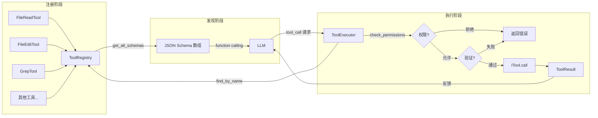
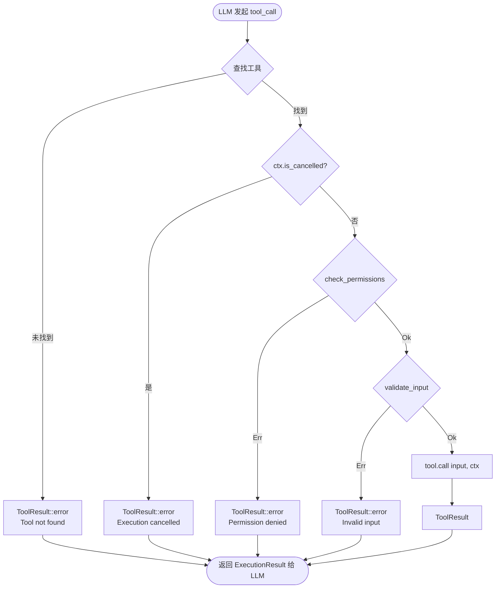
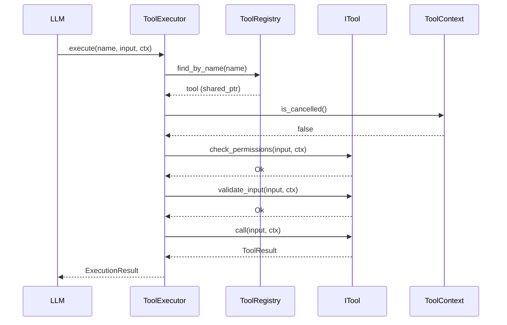

# Tool 系统架构

Agent 工具系统：统一管理 LLM 可调用工具的注册、发现、权限检查与执行。

## 目录结构

```
src/agent/tool/
├── core (header-only)        # 核心基础设施
│   ├── itool.h               # ITool 接口抽象基类
│   ├── result.h              # ToolResult 返回值类型
│   ├── context.h             # ToolContext 执行上下文
│   ├── types.h               # 输入/输出结构体定义
│   ├── registry.h            # ToolRegistry 工具注册表
│   └── executor.h            # ToolExecutor 工具执行器
│
├── FileReadTool/             # 文件读取（text/image/pdf/notebook）
├── FileEditTool/             # 文件编辑（字符串匹配替换）
├── FileWriteTool/            # 文件写入（创建/覆盖 + diff）
├── GlobTool/                 # 文件名匹配（glob 通配符）
├── GrepTool/                 # 内容搜索（正则/字面量）
├── BashTool/                 # Shell 命令执行
├── AgentTool/                # 子 Agent 调度
├── MCPTool/                  # MCP 外部工具调用
└── WebFetchTool/             # 网页抓取（HTML → Markdown）
```

## 核心组件

### ITool 接口

所有工具的抽象基类，定义统一契约：

```cpp
class ITool {
    virtual const std::string& name() const = 0;          // 工具名称
    virtual const std::string& description() const = 0;   // 简短描述
    virtual const std::string& prompt() const = 0;        // LLM 提示词
    virtual nlohmann::json input_schema() const = 0;      // JSON Schema
    virtual PermissionResult check_permissions(...) const; // 权限检查（默认允许）
    virtual ValidationResult validate_input(...) const;    // 输入验证（默认通过）
    virtual ToolResult call(...) = 0;                     // 执行（子类必须实现）
};
```

### ToolRegistry

工具注册表，管理所有工具实例的生命周期：

- `register_tool()` — 注册工具
- `find_by_name()` — 按名称查找
- `get_all_schemas()` — 生成 LLM function calling 所需的 schema 数组

### ToolExecutor

工具执行器，封装完整的执行管道：

- 查找工具 → 检查取消 → 权限检查 → 输入验证 → 执行 → 返回结果

## 执行管道图



## 执行流程图



## 工具调用时序图



## 工具目录说明

### Phase 0 — 文件操作（核心）

| 目录 | 工具名 | 功能 | 输入 |
|------|--------|------|------|
| `FileReadTool/` | `Read` | 读取文件内容（text/image/pdf/notebook） | `file_path`, `offset`, `limit`, `pages` |
| `FileEditTool/` | `Edit` | 精确字符串替换 | `file_path`, `old_string`, `new_string`, `replace_all` |
| `FileWriteTool/` | `Write` | 创建/覆盖文件 + 生成 diff | `file_path`, `content` |
| `GlobTool/` | `Glob` | glob 模式匹配文件路径 | `pattern`, `cwd` |
| `GrepTool/` | `Grep` | 正则/字面量搜索文件内容 | `pattern`, `path`, `case_insensitive`, `regex` |

### Phase 1 — 系统交互

| 目录 | 工具名 | 功能 | 输入 |
|------|--------|------|------|
| `BashTool/` | `Bash` | 执行 shell 命令 | `command`, `cwd`, `timeout` |
| `WebFetchTool/` | `WebFetch` | 抓取 URL 并转为 Markdown | `url`, `prompt` |

### Phase 2 — 高级调度

| 目录 | 工具名 | 功能 | 输入 |
|------|--------|------|------|
| `AgentTool/` | `Agent` | 启动子 Agent 处理子任务 | `prompt`, `tools` |
| `MCPTool/` | `MCP` | 调用 MCP 协议外部工具 | `server`, `tool`, `input` |

## 添加新工具

1. 创建目录 `src/agent/tool/YourTool/`
2. 编写 `your_tool.h` 和 `your_tool.cpp`，继承 `ITool`
3. 在 `types.h` 中添加输入/输出结构体（可选）
4. 在 `CMakeLists.txt` 中添加 `.cpp` 源文件
5. 在初始化代码中 `registry->register_tool(std::make_shared<YourTool>())`

```cpp
// your_tool.h
#pragma once
#include "agent/tool/itool.h"

namespace agent::tool {

class YourTool : public ITool {
public:
    const std::string& name() const override;
    const std::string& description() const override;
    const std::string& prompt() const override;
    nlohmann::json input_schema() const override;
    ToolResult call(const nlohmann::json& input, const ToolContext& ctx) override;
};

} // namespace agent::tool
```

## 设计原则

- **同步返回**：所有方法使用同步返回类型，无 `cppcoro::task`
- **header-only 核心**：基础设施（itool/registry/executor/result/context/types）全部 header-only
- **工具隔离**：每个工具独立目录，互不依赖
- **统一管道**：所有调用经 `ToolExecutor` 执行权限检查 → 验证 → 执行
- **Result 类型**：错误处理使用 `Result<T, E>`，不抛异常
