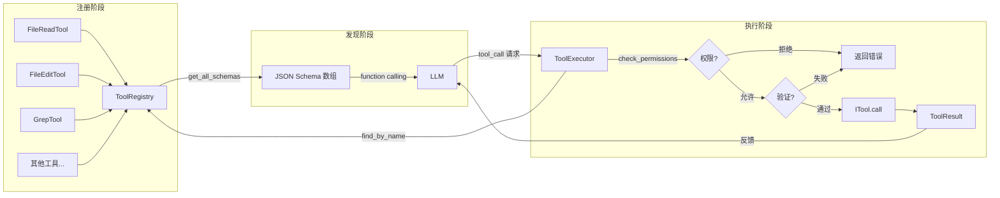
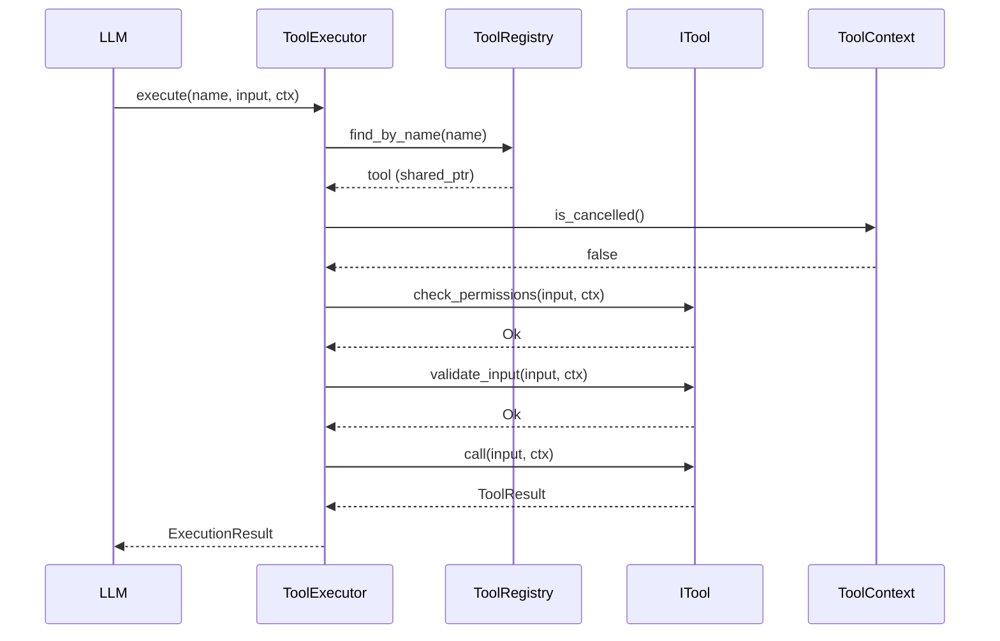

# Tool 系统架构

Agent 工具系统：统一管理 LLM 可调用工具的注册、发现、权限检查与执行。

## 目录结构

```
src/agent/tool/
├── core (header-only)        # 核心基础设施
│   ├── itool.h               # ITool 接口抽象基类
│   ├── result.h              # ToolResult 返回值类型
│   ├── context.h             # ToolContext 执行上下文
│   ├── types.h               # 输入/输出结构体定义
│   ├── registry.h            # ToolRegistry 工具注册表
│   └── executor.h            # ToolExecutor 工具执行器
│
├── FileReadTool/             # 文件读取（text/image/pdf/notebook）
├── FileEditTool/             # 文件编辑（字符串匹配替换）
├── FileWriteTool/            # 文件写入（创建/覆盖 + diff）
├── GlobTool/                 # 文件名匹配（glob 通配符）
├── GrepTool/                 # 内容搜索（正则/字面量）
├── BashTool/                 # Shell 命令执行
├── AgentTool/                # 子 Agent 调度
├── AskUser/                  # 向用户提问（TUI 选择面板，阻塞 + 超时）
├── MCPTool/                  # MCP 外部工具调用
└── WebFetchTool/             # 网页抓取（HTML → Markdown）
```

## 核心组件

### ITool 接口

所有工具的抽象基类，定义统一契约：

```cpp
class ITool {
    virtual const std::string& name() const = 0;          // 工具名称
    virtual const std::string& description() const = 0;   // 简短描述
    virtual const std::string& prompt() const = 0;        // LLM 提示词
    virtual nlohmann::json input_schema() const = 0;      // JSON Schema
    virtual PermissionResult check_permissions(...) const; // 权限检查（默认允许）
    virtual ValidationResult validate_input(...) const;    // 输入验证（默认通过）
    virtual ToolResult call(...) = 0;                     // 执行（子类必须实现）
};
```

> **call 协作取消契约**：`call()` 收到的 `ctx` 已绑定外部 `cancel_flag`（`const std::atomic<bool>*`，
> 由 ReActLoop 注入为 `Task::m_should_cancel`）。长操作 / 有副作用的工具应在执行中轮询
> `ctx.is_cancelled()` 并在取消时及时返回 `Error{Code::Cancelled}`（协作取消），
> 短操作可依赖执行器的前置检查。

### ToolRegistry

工具注册表，管理所有工具实例的生命周期：

- `register_tool()` — 注册工具
- `find_by_name()` — 按名称查找
- `get_all_schemas()` — 生成 LLM function calling 所需的 schema 数组

### ToolExecutor

工具执行器，封装完整的执行管道：

- 查找工具 → 检查取消 → 权限检查 → 输入验证 → 执行 → 返回结果

## 执行管道图



## 执行流程图


## 工具调用时序图



## 工具目录说明

### Phase 0 — 文件操作（核心）

| 目录 | 工具名 | 功能 | 输入 |
|------|--------|------|------|
| `FileReadTool/` | `Read` | 读取文件内容（text/image/pdf/notebook） | `file_path`, `offset`, `limit`, `pages` |
| `FileEditTool/` | `Edit` | 精确字符串替换 | `file_path`, `old_string`, `new_string`, `replace_all` |
| `FileWriteTool/` | `Write` | 创建/覆盖文件 + 生成 diff | `file_path`, `content` |
| `GlobTool/` | `Glob` | glob 模式匹配文件路径 | `pattern`, `cwd` |
| `GrepTool/` | `Grep` | 正则/字面量搜索文件内容 | `pattern`, `path`, `case_insensitive`, `regex` |

### Phase 1 — 系统交互

| 目录 | 工具名 | 功能 | 输入 |
|------|--------|------|------|
| `BashTool/` | `Bash` | 执行 shell 命令 | `command`, `cwd`, `timeout` |
| `WebFetchTool/` | `WebFetch` | 抓取 URL 并转为 Markdown | `url`, `prompt` |

### Phase 2 — 高级调度

| 目录 | 工具名 | 功能 | 输入 |
|------|--------|------|------|
| `AgentTool/` | `Agent` | 启动子 Agent 处理子任务 | `prompt`, `tools`, `run_in_background` |
| `AskUser/` | `AskUser` | 向用户提问（TUI 选择面板，阻塞 + 超时） | `questions`, `timeout_ms` |
| `MCPTool/` | `MCP` | 调用 MCP 协议外部工具 | `server`, `tool`, `input` |

## 打断与取消（interrupt / cancel）

> 关联：Issue #23 运行中打断生命周期。取消统一复用 `ctx.cancel_flag`（`Task::m_should_cancel`），
> 不引入独立 CancellationToken；分层各司其职，运行中打断即时生效且不留半写文件。

取消信号来源：用户 Ctrl+C / Esc → `InterruptEvent` → `ChatSession::subscribe_interrupt`
同时（1）`m_provider->interrupt()` 断开 LLM 流；（2）`m_current_task->cancel()` 置位 `should_cancel`
（P1 修复），随后 ReActLoop 与工具通过 `ctx.is_cancelled()` 即时感知。

执行分三个阶段，取消由三层协作：

| 阶段 | 层 | 取消机制 |
|------|----|----------|
| 前置（未开始） | `ToolExecutor::execute` | 统一检查 `ctx.is_cancelled()`，已取消立即返回 `Cancelled`，不进入 `call` |
| 执行中（长操作） | 工具内部 `call()` | 轮询 `ctx.is_cancelled()` 协作退出（协作取消；executor 是同步调用，进不了工具内部） |
| 等待工具返回 | ReActLoop 工具等待循环 | `future.wait_for(100ms)` 轮询（P1），工具协作退出后照常生成 Observation，消息不丢 |

**工具内取消点现状**：

| 工具 | 取消实现 |
|------|----------|
| BashTool / GlobTool(rg) / GrepTool(rg) | `exec` 的 `ExecOptions::is_cancelled` 绑定 `ctx.cancel_flag`；POSIX `setpgid + kill(-pid)` 销毁进程组（含 bash 子孙进程），SIGTERM → 5s 后 SIGKILL 升级（P1） |
| FileEditTool / FileWriteTool | 原子写：同目录临时文件 `.workx.tmp` → `fs::rename` 原子替换；取消点位于写临时文件前后，已取消则删除临时文件、返回 `Cancelled`，原文件保持完整（P2） |
| 其余短操作工具 | 依赖执行器前置检查 + 下一轮 Thought 取消，不额外插桩 |

**不丢会话记录的保证**：取消置位后 ReActLoop 必定从规范分支（Thought Cancelled / 工具 Cancelled）
返回，`persist_messages_range` 与 partial 持久化路径必然可达；文件工具的原子写保证写入中断不产生半写文件。

## 添加新工具

1. 创建目录 `src/agent/tool/YourTool/`
2. 编写 `your_tool.h` 和 `your_tool.cpp`，继承 `ITool`
3. 在 `types.h` 中添加输入/输出结构体（可选）
4. 在 `CMakeLists.txt` 中添加 `.cpp` 源文件
5. 在初始化代码中 `registry->register_tool(std::make_shared<YourTool>())`

```cpp
// your_tool.h
#pragma once
#include "agent/tool/itool.h"

namespace agent::tool {

class YourTool : public ITool {
public:
    const std::string& name() const override;
    const std::string& description() const override;
    const std::string& prompt() const override;
    nlohmann::json input_schema() const override;
    ToolResult call(const nlohmann::json& input, const ToolContext& ctx) override;
};

} // namespace agent::tool
```

## 设计原则

- **同步返回**：所有方法使用同步返回类型，无 `cppcoro::task`
- **header-only 核心**：基础设施（itool/registry/executor/result/context/types）全部 header-only
- **工具隔离**：每个工具独立目录，互不依赖
- **统一管道**：所有调用经 `ToolExecutor` 执行权限检查 → 验证 → 执行
- **协作取消**：取消信号经 `ctx.cancel_flag`（唯一取消源）下发，工具在执行中自行轮询协作退出
- **原子写**：文件写入先落盘临时文件再 rename，中断不留半写文件
- **Result 类型**：错误处理使用 `Result<T, E>`，不抛异常

## 外部工具集成

### 为什么需要外部工具

部分工具能力用 C++ 标准库实现成本高、性能差，而生态中有成熟的 CLI 工具可直接复用：

| 场景 | 外部工具 | 替代的 C++ 实现 |
|------|---------|---------------|
| 文件名 glob 匹配 | ripgrep (`rg --files --glob`) | `fs::recursive_directory_iterator` |
| 文件内容正则搜索 | ripgrep (`rg pattern`) | `std::regex` + 手写遍历 |
| Shell 命令执行 | bash / cmd | 自实现 shell |

ripgrep 等工具在大仓库下性能比 C++ 标准库遍历快一个数量级，且自带 `.gitignore` 支持、修改时间排序、多线程等能力。

### subprocess 是什么

**subprocess = "在程序里启动另一个外部程序，并捕获它的输出"**。

WorkX 是 C++ 程序，但有时要调用 `rg.exe` / `git` / `bash` 等外部命令。直接用 `system()` 不行（拿不到输出、无法超时、无法取消），需要封装操作系统的进程 API：

- **Windows**: `CreateProcessW` + `CreatePipe` + `ReadFile`
- **POSIX**: `fork` + `execvp` + `pipe` + `poll`

C++ 标准库没有 subprocess 能力，需自建封装。该封装是 BashTool / GlobTool(rg 模式) / GrepTool(rg 模式) 的共享地基。

### 设计决策：不做"进程管理器"

经调研 Claude Code CLI 的实现（`example/cc/`），CC **没有统一的进程管理器**，而是用"per-call 进程封装 + 路径缓存"的组合模式：

| 关注点 | CC 的做法 | WorkX 对应设计 |
|--------|-----------|--------------|
| rg 路径解析与缓存 | `getRipgrepConfig = memoize(...)` | `ToolRegistry` 单例（只缓存路径，不管理进程） |
| 单次进程执行 | per-call 的 `ShellCommand` 对象 | `subprocess::exec()` 函数（同步执行，无需类） |
| 取消传播 | WeakRef 链式 `AbortController` | 复用项目已有的 `ToolContext::is_cancelled()` 回调 |
| 进程池/复用 | 无，每次 spawn 新进程 | 无，每次 exec 新建进程 |

**不做进程管理器的理由**：
- 进程是 per-call 的，不池化不复用（CC 也是每次新建）
- 取消用项目已有的 `ToolContext::is_cancelled()`，不需要单独的 AbortController 链
- 孤儿进程防护由 subprocess 内部保证（超时/取消时一定 kill），不需要全局注册表

### 架构分层

```
┌─────────────────────────────────────────────────┐
│  Layer 3: 工具适配（tool/ 下各 Tool 目录）        │
│  GlobTool / GrepTool / BashTool                  │
│  - 优先用外部工具(rg)，失败回退 C++ 实现         │
│  - 返回 ResultV2<ToolResult>（项目统一类型）     │
├─────────────────────────────────────────────────┤
│  Layer 2: 外部工具注册表（core/process/）        │
│  - 发现 rg 位置（bundled > PATH > 配置）         │
│  - 版本探测与缓存（只管路径，不管进程）          │
├─────────────────────────────────────────────────┤
│  Layer 1: subprocess 核心（core/process/）       │
│  - 跨平台 exec：启动 + 管道 + 超时 + 取消        │
│  - 返回 ResultV2<ExecOutput>（与项目风格一致）   │
└─────────────────────────────────────────────────┘
```

**返回类型遵循项目约定**：
- subprocess 层：`ResultV2<ExecOutput>`（`ExecOutput` 含 `stdout_text`/`stderr_text`/`exit_code`）
- 工具层：`ResultV2<ToolResult>`（与 FileReadTool/FileWriteTool/FileEditTool 完全一致）
- 工具 `call()` 内部把 `ExecOutput` 转成 `ToolResult::ok(text)` 返回给 LLM

### subprocess 核心接口

```cpp
// core/process/subprocess.h
namespace agent::process {

struct ExecOutput {
    int exit_code = -1;
    std::string stdout_text;
    std::string stderr_text;
    bool timed_out = false;
    bool cancelled = false;
};

struct ExecOptions {
    std::string cwd;
    std::vector<std::string> args;
    std::optional<std::chrono::milliseconds> timeout;
    std::function<bool()> is_cancelled;  // 接 ToolContext::is_cancelled
};

/// 同步执行，捕获输出。超时/取消时：
/// - POSIX: kill(SIGTERM) → 5s 后 kill(SIGKILL)  (对齐 CC ripgrep.ts L174-182)
/// - Windows: TerminateProcess（无 SIGTERM 概念，直接杀）
/// 返回 ExecOutput，不抛异常。
ResultV2<ExecOutput> exec(const std::string& cmd, const ExecOptions& opts);

} // namespace agent::process
```

**关键设计点（对齐 CC）**：
- **是函数不是类** — CC 的 `ShellCommand` 是类是因为它要支持 background/streaming，WorkX 初期只需同步执行，函数足够
- **SIGTERM→SIGKILL 升级** — POSIX 独有，因为 rg 可能卡在不可中断 I/O（CC 注释明确说明）
- **Windows 直接 TerminateProcess** — 无信号概念，CC 也是 `child.kill()` 无升级
- **is_cancelled 轮询** — C++ 无标准 AbortSignal，复用项目已有的 `ToolContext` 回调最简单

### ToolRegistry：路径缓存（非进程管理）

```cpp
// core/process/tool_registry.h
namespace agent::process {

class ToolRegistry {
public:
    static ToolRegistry& instance();

    /// 查找 rg 路径，首次调用时探测，结果缓存
    /// 顺序：config > bundled(<exe_dir>/tools/rg) > PATH
    /// 全部失败返回 nullopt（工具层回退 C++ 实现）
    std::optional<std::string> resolve_ripgrep() const;

private:
    ToolRegistry();
    mutable std::mutex m_mutex;
    mutable std::optional<std::string> m_rg_cache;  // 首次解析后缓存
    // 对齐 CC ripgrep.ts L31 getRipgrepConfig = memoize(...)
};

} // namespace agent::process
```

**为什么是"路径缓存"不是"进程管理器"**：
- 不管理进程生命周期（那是 `subprocess::exec` 的职责）
- 不池化进程（每次 call 新建）
- 只做一件事：rg 在哪？缓存答案

### 目录结构（规划）

```
scripts/
└── fetch-ripgrep.py             # 跨平台下载 ripgrep 二进制（开发期 + CI）

src/core/process/                # subprocess 核心 + 工具注册表（跨模块共享）
├── subprocess.h/.cpp            # 跨平台 exec 封装
├── exec_output.h                # ExecOutput 结构体
└── tool_registry.h/.cpp         # 外部工具发现与版本探测

vendor/ripgrep/                  # ripgrep 预编译二进制（不入库，脚本下载）
├── windows/rg.exe
├── macos/rg
└── linux/rg

src/agent/tool/
├── GlobTool/
│   ├── glob_tool.h/.cpp         # ITool 实现：rg 优先 + C++ fallback
│   └── glob_engine.h/.cpp       # C++ 标准库 fallback 实现
└── GrepTool/
    ├── grep_tool.h/.cpp         # ITool 实现：rg 优先 + C++ fallback
    └── grep_engine.h/.cpp       # C++ 标准库 fallback 实现
```

### ripgrep 二进制获取：Python 脚本

`vendor/ripgrep/` 下的二进制**不入 git 仓库**（体积大、平台相关），通过 `scripts/fetch-ripgrep.py` 获取。

**为什么用 Python 而非 PowerShell/Bash**：一份代码跨平台运行，CI 和开发期统一调用，无需维护两套脚本。

**开发期**：
```bash
python scripts/fetch-ripgrep.py
# 或指定版本
python scripts/fetch-ripgrep.py --version 14.1.1
# 强制重新下载
python scripts/fetch-ripgrep.py --force
```

脚本自动检测平台（Windows/macOS/Linux）和架构（x86_64/aarch64），下载对应 ripgrep Release，解压 `rg` 到 `vendor/ripgrep/<platform>/`。**幂等**：目标已存在则跳过。

**CI（GitHub Actions）**：

```yaml
jobs:
  build:
    strategy:
      matrix:
        include:
          - os: windows-latest
          - os: macos-latest
          - os: ubuntu-latest
    steps:
      - uses: actions/checkout@v4
      - name: Fetch ripgrep
        run: python scripts/fetch-ripgrep.py
      - name: Configure CMake
        run: cmake -B build -DCMAKE_BUILD_TYPE=Release
      - name: Build
        run: cmake --build build --config Release
```

### CMakeLists: 构建时自动拷贝 rg 到输出目录

项目现状：`CMAKE_RUNTIME_OUTPUT_DIRECTORY = ${CMAKE_BINARY_DIR}/bin`，无 install 规则，用户直接运行 build 目录里的 binary。

策略：`add_custom_command POST_BUILD` 把对应平台的 rg 拷贝到 binary 旁的 `tools/` 子目录，运行时从 `<exe_dir>/tools/rg` 查找。

```cmake
# ---- vendor/ripgrep: 构建时拷贝到输出目录 ----
# 目录结构: vendor/ripgrep/{windows,macos,linux}/rg(.exe)
# 由 scripts/fetch-ripgrep.py 下载
set(WORKX_VENDOR_RIPGREP_DIR ${CMAKE_SOURCE_DIR}/vendor/ripgrep)

if(WIN32)
    set(WORKX_RG_SOURCE ${WORKX_VENDOR_RIPGREP_DIR}/windows/rg.exe)
    set(WORKX_RG_DEST_NAME rg.exe)
elseif(APPLE)
    set(WORKX_RG_SOURCE ${WORKX_VENDOR_RIPGREP_DIR}/macos/rg)
    set(WORKX_RG_DEST_NAME rg)
else()
    set(WORKX_RG_SOURCE ${WORKX_VENDOR_RIPGREP_DIR}/linux/rg)
    set(WORKX_RG_DEST_NAME rg)
endif()

# 只有当 vendor 二进制实际存在时才拷贝（脚本下载或手动放入）
if(EXISTS "${WORKX_RG_SOURCE}")
    # 拷贝到 $<TARGET_FILE_DIR:workx>/tools/rg(.exe)，运行时从 <exe_dir>/tools/ 查找
    add_custom_command(TARGET workx POST_BUILD
        COMMAND ${CMAKE_COMMAND} -E make_directory
            "$<TARGET_FILE_DIR:workx>/tools"
        COMMAND ${CMAKE_COMMAND} -E copy_if_different
            "${WORKX_RG_SOURCE}"
            "$<TARGET_FILE_DIR:workx>/tools/${WORKX_RG_DEST_NAME}"
        COMMENT "Bundling ripgrep: ${WORKX_RG_DEST_NAME}"
    )
    target_compile_definitions(workx PRIVATE WORKX_HAS_BUNDLED_RIPGREP=1)
else()
    message(STATUS "ripgrep: vendor binary not found at ${WORKX_RG_SOURCE}, fallback to C++ implementation")
endif()
```

**关键点**：
- `copy_if_different` 增量拷贝，不每次都复制
- `EXISTS` 检查让缺失二进制时不报错，自动回退 C++ 实现
- `WORKX_HAS_BUNDLED_RIPGREP` 编译宏让代码知道是否可用 bundled 版本

### 运行时查找顺序（对齐 Claude Code）

`ToolRegistry::resolve_ripgrep()` 按以下顺序查找，首个命中即缓存：

1. **配置覆盖**：`config.tool_path.ripgrep`（用户显式指定）
2. **bundled**：`<executable_dir>/tools/rg(.exe)`
3. **PATH**：`which rg` / `where rg.exe`
4. **全部失败**：返回 `nullopt`，工具层回退到 C++ 标准库实现

### 工具层组合示例

```cpp
// GlobTool::call()
ResultV2<ToolResult> GlobTool::call(const json& input, const ToolContext& ctx) const {
    // 1. 查 rg 路径（缓存命中，几乎零开销）
    if (auto rg = ToolRegistry::instance().resolve_ripgrep()) {
        // 2. 用 subprocess 执行 rg
        auto result = process::exec(*rg, {
            .cwd = base_dir,
            .args = {"--files", "--glob", pattern, "--sort=modified"},
            .timeout = std::chrono::seconds(30),
            .is_cancelled = [&ctx] { return ctx.is_cancelled(); },
        });
        if (result.is_ok()) {
            return ResultV2<ToolResult>::ok(
                ToolResult::ok(format_rg_output(result.value().stdout_text))
            );
        }
        // rg 失败则回退 C++ 实现
    }
    // 3. fallback: C++ 标准库实现
    return call_with_native(input, ctx);
}
```

### 演进路线

```
阶段 1: core/process/subprocess 基础封装 + ToolRegistry
        → BashTool 可直接复用，GlobTool/GrepTool 接入 rg
阶段 2: ToolRegistry 完善
        → 支持配置文件指定外部工具路径
阶段 3: 内置工具适配器
        → 接入 fd / bat / jq 等常用 CLI
阶段 4: MCP 客户端
        → 接入第三方 MCP server 工具生态（已有 MCPTool 占位）
```

阶段 1 是地基，后续所有外部工具集成都基于此。
