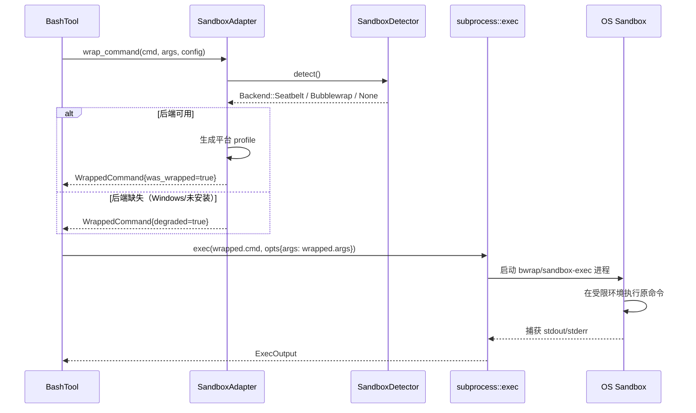

# Sandbox 沙盒模块架构

在 `subprocess::exec()` 之上提供命令包装（Command Wrapping）层，通过 OS 原生沙盒工具
（macOS `sandbox-exec` / Linux `bwrap`）对子进程实施文件系统与网络隔离。

## 设计目标

1. **不侵入 subprocess**——沙盒逻辑作为独立适配层，在 `exec()` 之前把原命令包装成
   带沙盒前缀的命令字符串，subprocess 本身不感知沙盒存在
2. **平台条件编译**——macOS/Linux 使用 OS 原生沙盒；Windows 无进程级沙盒，仅返回原命令
3. **规则可配置**——通过 `SandboxConfig` 描述允许/拒绝的路径与域名，运行时生成对应 profile
4. **优雅降级**——沙盒工具缺失时返回原命令并标记 `degraded`，不阻断业务

## 目录结构

```
src/core/process/sandbox/
├── README.md                  # 本文档
├── sandbox_config.h           # SandboxConfig 规则配置数据结构
├── sandbox_detector.h         # 平台沙盒工具探测接口
├── sandbox_detector.cpp       # bwrap / sandbox-exec 路径缓存
├── sandbox_adapter.h          # 命令包装适配器接口
└── sandbox_adapter.cpp        # 平台 profile 生成与命令包装实现
```

## 架构分层

```
┌──────────────────────────────────────────────────────────┐
│  BashTool / GrepTool（调用方）                            │
│         │                                                 │
│         ▼                                                 │
│  sandbox_adapter::wrap_command(cmd, args, config)        │
│         │                                                 │
│         ├─→ sandbox_detector::detect()  探测 OS 沙盒工具  │
│         ├─→ 生成平台 profile（macOS Seatbelt / Linux bwrap）│
│         └─→ 返回包装后的 (new_cmd, new_args)              │
│         │                                                 │
│         ▼                                                 │
│  subprocess::exec(new_cmd, opts_with_new_args)           │
│         │                                                 │
│         ▼                                                 │
│  OS 原生沙盒工具（bwrap / sandbox-exec）                  │
│         │                                                 │
│         ▼                                                 │
│  实际命令（rg / git / ...）在受限环境中运行                │
└──────────────────────────────────────────────────────────┘
```

## 核心接口

### SandboxConfig（规则配置）

```cpp
struct SandboxConfig {
    std::vector<std::string> allow_write;   // 允许写入的路径前缀
    std::vector<std::string> deny_write;    // 拒绝写入的路径前缀
    std::vector<std::string> allow_read;    // 允许读取的路径前缀
    std::vector<std::string> deny_read;     // 拒绝读取的路径前缀
    std::vector<std::string> allow_domains; // 允许的网络域名（通配符）
    std::vector<std::string> deny_domains;  // 拒绝的网络域名
    bool network_isolated = true;           // 是否隔离网络（默认隔离）

    /// 构建默认配置：仅允许 cwd 读写，隔离网络
    static SandboxConfig restrictive(const std::string& cwd);
    /// 构建宽松配置：允许全盘读写（用于 dangerously_disable_sandbox 场景）
    static SandboxConfig permissive();
};
```

### SandboxDetector（平台探测）

```cpp
class SandboxDetector {
public:
    enum class Backend { None, Seatbelt, Bubblewrap };
    Backend detect();               // 探测并缓存后端类型
    std::optional<std::string> path(); // 沙盒工具路径
    bool is_available();            // 沙盒是否可用
    static SandboxDetector& instance();
};
```

### SandboxAdapter（命令包装）

```cpp
struct WrappedCommand {
    std::string cmd;                // 包装后的命令（可能是 bwrap/sandbox-exec）
    std::vector<std::string> args;  // 包装后的参数列表
    bool was_wrapped;               // 是否实际包装（false 表示降级或未启用）
    bool degraded;                  // 是否降级（沙盒工具缺失）
    std::string backend_name;       // 使用的后端名称（"seatbelt" / "bubblewrap" / "none"）
};

class SandboxAdapter {
public:
    /// 包装命令：根据 config 和平台生成包装后的命令
    static WrappedCommand wrap_command(
        const std::string& cmd,
        const std::vector<std::string>& args,
        const SandboxConfig& config
    );

    /// 是否启用沙盒（编译期 + 运行期双重判定）
    static bool is_enabled();
};
```

## 平台支持矩阵

| 平台    | 后端          | 工具          | 状态   | 备注                       |
|---------|---------------|---------------|--------|----------------------------|
| macOS   | Seatbelt      | `sandbox-exec`| ✅ 支持 | 系统自带，无需安装         |
| Linux   | Bubblewrap    | `bwrap`       | ✅ 支持 | 需系统安装（Flatpak 默认带）|
| Windows | —             | —             | ⚠️ 降级 | 无进程级沙盒，返回原命令   |

## 与 subprocess 的配合流程



## 平台 Profile 生成规则

### macOS（Seatbelt / sandbox-exec）

生成 SBPL（Scheme-Based Profile Language）profile 字符串，通过 `-p` 参数传入：

```
sandbox-exec -p '(version 1)
(deny default)
(allow process-fork)
(allow signal (target self))
(allow process-info* (target self))
(allow sysctl-read)
(allow file-read* (subpath "/usr"))
(allow file-read* (subpath "/lib"))
(allow file-read* (subpath "/etc"))
(allow file-read* (subpath "/tmp"))
(allow file-write* (subpath "/tmp/workx_sandbox"))
(deny file-write*)
(allow network* (remote tcp "github.com:443"))
(deny network*)
' -- /bin/sh -c "原始命令"
```

### Linux（Bubblewrap / bwrap）

通过命令行参数指定 bind mount 和 namespace：

```
bwrap \
  --bind / / \                    # 根文件系统只读 bind
  --dev /dev \                    # 挂载 /dev
  --proc /proc \                  # 挂载 /proc
  --tmpfs /tmp \                  # 临时目录独立 tmpfs
  --bind /tmp/workx_sandbox /tmp \# 可写目录 bind
  --unshare-net \                 # 隔离网络命名空间（如配置 network_isolated）
  -- /bin/sh -c "原始命令"
```

## 配置示例

```cpp
// 1. 默认严格模式：仅允许 cwd 读写，隔离网络
SandboxConfig config = SandboxConfig::restrictive("/path/to/project");
auto wrapped = SandboxAdapter::wrap_command("rg", {"pattern", "."}, config);
// wrapped.cmd = "bwrap", wrapped.args = {..., "--", "rg", "pattern", "."}

// 2. 允许特定域名访问（如 git clone）
SandboxConfig config = SandboxConfig::restrictive("/path/to/project");
config.allow_domains = {"github.com", "*.githubusercontent.com"};
config.network_isolated = false;
auto wrapped = SandboxAdapter::wrap_command("git", {"clone", "url"}, config);

// 3. 危险跳过沙盒
auto wrapped = SandboxAdapter::wrap_command("rm", {"-rf", "/tmp/build"}, SandboxConfig::permissive());
// wrapped.was_wrapped = false, wrapped.degraded = false
```

## 使用约束

1. **沙盒不替代权限校验**——`SandboxAdapter` 只做命令包装，工具层的 `check_permissions()`
   仍需独立判断是否允许执行该命令
2. **Windows 仅降级模式**——Windows 无进程级沙盒，`wrap_command()` 返回原命令并标记
   `degraded=true`，调用方应据此提示用户或回退到路径规则匹配
3. **沙盒工具路径缓存**——`SandboxDetector` 首次探测后缓存结果，避免每次 `exec()` 都
   搜索 PATH
4. **profile 字符串注入防护**——生成 profile 时对路径参数做转义，防止命令注入
5. **cwd 一致性**——包装后的命令默认在沙盒内保持原 cwd，调用方无需额外处理

## 后续扩展

- **Windows AppContainer**——未来可在 Windows 上使用 AppContainer 实现进程级隔离
- **seccomp 过滤**——Linux 上可叠加 seccomp 过滤系统调用，进一步限制子进程能力
- **违规事件回调**——沙盒违规时通过回调通知 UI 层展示（对齐 CC 的 `SandboxViolationExpandedView`）
- **动态规则更新**——运行时热更新 `SandboxConfig`，无需重启进程
